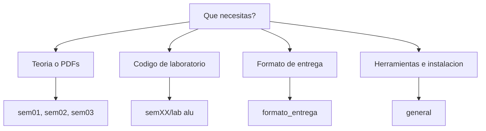

# Estructuras de Datos - UNMSM 2026-1

Material de estudio del curso **Estructura de Datos** (Escuela de Ingenieria de Sistemas) dictado por el profesor Gilberto Salinas Azaña.
Incluye teoria, practicas y codigo organizado por semanas.

> Solo lectura: el repo lo mantiene Mathias Flores Hoyos. Si encuentras un error o quieres sugerir algo, abre un [Issue](https://github.com/Opiumxth/estructura_datos/issues).

---

## Como usar este repo

**Opcion A - Descargar todo**

```bash
git clone https://github.com/Opiumxth/estructura_datos.git
```

**Opcion B - Descargar solo archivos puntuales**

1. Entra a la carpeta o archivo en GitHub.
2. Abre el archivo que necesites.
3. Haz clic en **Download raw file** (icono de descarga).

---

## Estructura del repo

```text
estructuras_datos/
|
|- general/                  # Material general del curso y guias de instalacion
|- formato_entrega/          # Plantillas y formato oficial de entrega
|- sem01/                    # Semana 1: TAD, arreglos, archivos estaticos
|- sem02/                    # Semana 2: metodos de busqueda
|- sem03/                    # Semana 3: metodos de ordenamiento
|- sem04/
|- sem05/
|- Silvia Cairo, Osvaldo_Guardati - Estructura de Datos (...).pdf
`- Algoritmos y estructura de datos - Joyanes.pdf
```

## Mapa rapido (cuando no sabes donde entrar)



---

## Contenido por semana

| Semana | Tema principal                     | Teoria | Lab |
| ------ | ---------------------------------- | ------ | --- |
| 01     | TAD, arreglos y archivos estaticos | Si     | Si  |
| 02     | Metodos de busqueda                | Si     | Si  |
| 03     | Metodos de ordenamiento            | Si     | Si  |
| 04     | Pendiente                          | -      | -   |
| 05     | Pendiente                          | -      | -   |

---

## Libros del curso

Libros en la raiz del repo:

- `Silvia Cairo, Osvaldo_Guardati - Estructura de Datos (2006, MC GRAW HILL INTERAMERICANA) - libgen.li.pdf` (principal)
- `Algoritmos y estructura de datos - Joyanes.pdf` (referencia)

---

## Herramientas del curso

El codigo del repositorio esta en **C/C++** y **Java**.

**C/C++ con Code::Blocks**
- Guia: `general/tutorlInstalCodeBlocks20.03.pdf`

**Java con NetBeans/Eclipse**
- Guia: `general/tutorInstalacionJavaEclipse v2.pdf`

**Compilacion rapida en Linux/Ubuntu (C/C++)**

```bash
g++ archivo.cpp -o archivo
./archivo
```

---

## Notas

- El codigo en `lab alu/` corresponde a sesiones de laboratorio y puede estar incompleto o experimental.
- Los archivos objeto y ejecutables no se suben al repo (ver `.gitignore`).
- El contenido de `general/` y `formato_entrega/` es material oficial del curso.