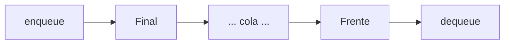
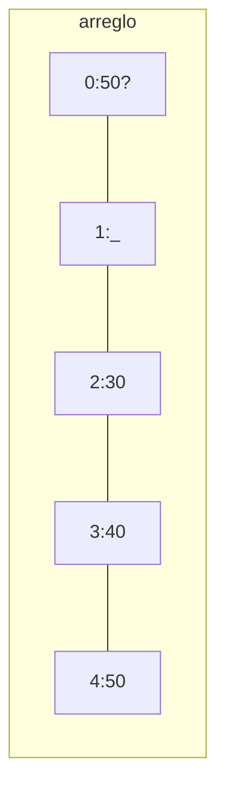

# Colas — Repaso ultracompacto

Fuente: `repaso_final/09_colas.md`, sem07, lab cola.

---

## 1. ¿Qué es una cola?

**Qué es:** estructura lineal **FIFO** — First In, First Out.  
Entra por el **final**, sale por el **frente**.

**Para qué sirve:** modelar filas / turnos / orden de llegada.

**Cuándo se usa:** impresión, scheduling de CPU, buffers, simulación de clientes, **BFS**.



**Analogía:** fila del banco — el primero en llegar es el primero atendido.

---

## 2. FIFO (vs pila)

| | Pila | Cola |
|--|------|------|
| Política | **LIFO** | **FIFO** |
| Entra por | tope | final |
| Sale por | tope | frente |
| Extremos | 1 | 2 |

Si el enunciado dice “turnos / llegada / fila / atención” → **cola**.  
Si dice “deshacer / último / reversa” → pila.

---

## 3. Operaciones

| Operación | Qué hace | Complejidad |
|-----------|----------|-------------|
| `enqueue(x)` | agrega al final | **O(1)** |
| `dequeue()` | quita y devuelve el frente | **O(1)** |
| `front()` / `peek()` | mira el frente sin quitar | **O(1)** |
| `isEmpty()` | ¿vacía? | **O(1)** |

**Overflow:** enqueue en cola llena (arreglo).  
**Underflow:** dequeue en cola vacía.

### Ejemplo sencillo

```
enqueue(1) → [1]
enqueue(2) → [1, 2]
enqueue(3) → [1, 2, 3]
dequeue()  → 1; queda [2, 3]
dequeue()  → 2; queda [3]
```

---

## 4. Cola circular (arreglo)

**Qué es:** cola en arreglo donde los índices “dan la vuelta” con `% MAX`.

**Para qué:** reutilizar espacio al inicio del arreglo (la lineal lo desperdicia tras varios dequeue).

**Cuándo:** tamaño máximo conocido; implementación fija.

```
Lineal:  dequeue,dequeue → [_, _, 3, 4, 5]   ← huecos perdidos
Circular: luego enqueue(6) → [6, _, 3, 4, 5] ← posición 0 reutilizada
```

**Clave del código:**

```
enqueue: datos[final] = x;  final = (final + 1) % MAX;  tam++
dequeue: val = datos[frente];  frente = (frente + 1) % MAX;  tam--
vacía: tam == 0
llena: tam == MAX
```

### Traza (MAX = 5)

```
enqueue(10): datos[0]=10, final=1, tam=1
enqueue(20): datos[1]=20, final=2, tam=2
enqueue(30): datos[2]=30, final=3, tam=3
dequeue():   →10, frente=1, tam=2
dequeue():   →20, frente=2, tam=1
enqueue(40): datos[3]=40, final=4, tam=2
enqueue(50): datos[4]=50, final=0  ← dio la vuelta
```



**Ventajas:** O(1), memoria fija, reutiliza celdas.  
**Desventajas:** tamaño máximo fijo; hay que manejar “llena”.

---

## 5. Cola enlazada

**Qué es:** cola con nodos; punteros `frente` y `final`.

**Estructura:**

```
frente → [dato|sgte] → [dato|sgte] → NULL
                          ↑
                        final
```

**Enqueue:** crear nodo, enlazarlo al final, `final = nuevo`.  
Si estaba vacía: `frente = final = nuevo`.

**Dequeue:** sacar `frente`, avanzar; **si `frente` queda NULL → `final = NULL`**.

**Ventajas:** crece dinámicamente; no overflow por tamaño fijo.  
**Desventajas:** memoria extra por nodos; riesgo de dangling pointer si olvidas `final`.

---

## 6. Complejidad (resumen)

| Impl. | enqueue | dequeue | espacio |
|-------|---------|---------|---------|
| Circular | O(1) | O(1) | O(MAX) fijo |
| Enlazada | O(1) | O(1) | O(n) dinámico |

---

## 7. Casos típicos de examen

1. **Traza** enqueue/dequeue → estado final (dibuja: frente ← … ← final).
2. **Circular:** dan MAX y preguntan `frente`, `final`, `tam` tras operaciones.
3. **Pila vs cola** teórica.
4. Completar código lista: no olvidar `final = NULL`.
5. “Simular atención de clientes” → cola.

**Ejercicio rápido:**  
`enqueue(A), enqueue(B), dequeue(), enqueue(C), enqueue(D), dequeue(), dequeue()`  
→ dequeues: A, B, C · queda: `[D]`.

---

## 8. Errores frecuentes

| Error | Consecuencia |
|-------|----------------|
| Confundir frente y final | enqueue/dequeue al extremo incorrecto |
| Olvidar `final = NULL` al vaciar (lista) | dangling pointer |
| No usar `% MAX` en circular | índice fuera de rango |
| Mezclar LIFO con FIFO | lógica incorrecta |
| Dequeue en vacía / enqueue en llena | underflow / overflow |

---

## Chuleta de 30 segundos

```
COLA = FIFO
Entra FINAL · Sale FRENTE
Circular: (i+1) % MAX
Lista: si frente==NULL tras dequeue → final=NULL
Todas las ops básicas: O(1)
BFS usa cola · DFS usa pila
```
