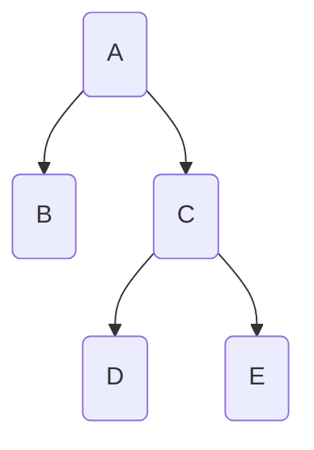
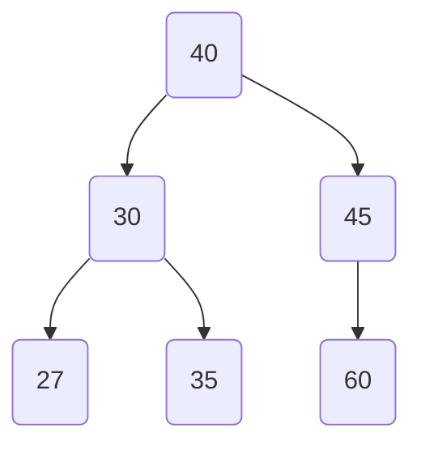
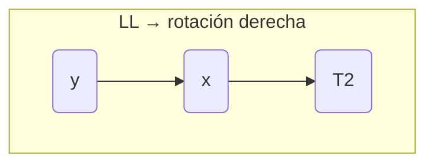
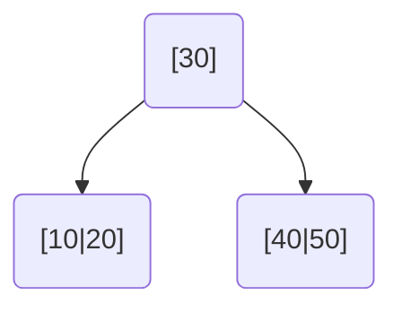
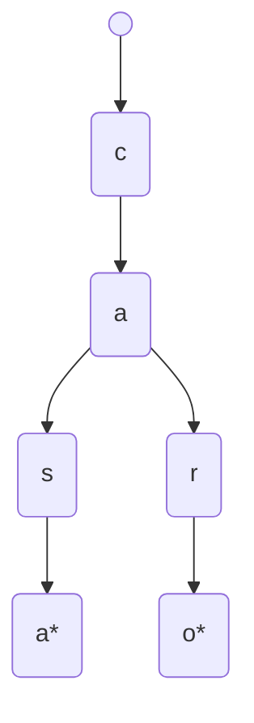
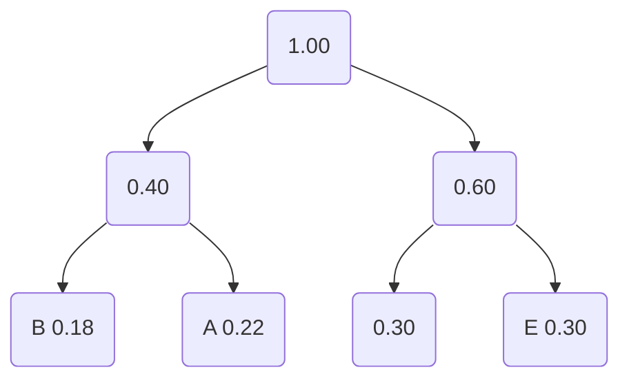

# Árboles — Repaso ultracompacto

Fuente: `repaso_final/10`–`15`, PDFs sem09–sem12, labs ABB/AVL/B/Trie/Huffman.

Solo lo necesario para examen. Cada estructura: definición → estructura → ops → complejidad → cuándo → vs anterior.

---

## 0. Vocabulario (prerrequisito)

| Término | Significado |
|---------|-------------|
| Raíz | nodo sin padre |
| Hoja | nodo sin hijos |
| Altura | aristas hasta la hoja más lejana (vacío = **-1**) |
| Nivel | distancia desde la raíz (raíz = 0) |

---

# 1. Árbol binario

**Qué es:** jerarquía donde cada nodo tiene **máximo 2 hijos** (izq / der).

**Estructura:**

```cpp
struct NODO { TD info; NODO *izq; NODO *der; };
```



**Inserción / búsqueda / eliminación:** en binario *general* no hay orden → hay que indicar posición o recorrer todo.

**Recorridos (memorizar):**

| Nombre | Orden | Sigla |
|--------|-------|-------|
| PreOrden | Raíz → Izq → Der | **RID** |
| InOrden | Izq → Raíz → Der | **IRD** |
| PostOrden | Izq → Der → Raíz | **IDR** |

Ejemplo del árbol de arriba:  
Pre: A B C D E · In: B A D C E · Post: B D E C A

**Complejidad:** recorridos O(n); búsqueda sin orden O(n).

**Ventajas:** modela jerarquías; base de ABB/AVL/Huffman.  
**Desventajas:** sin propiedad de orden, buscar es lento.

**Cuándo:** expresiones, jerarquías, base para otros árboles.  
**Errores:** olvidar `if (raiz == NULL)`; no inicializar izq/der a NULL; confundir RID/IRD/IDR.

---

# 2. ABB (Árbol Binario de Búsqueda)

**Qué es:** árbol binario con **propiedad de orden**.

**Propiedad:** para todo nodo → subárbol izq **<** raíz **≤** subárbol der.

**Estructura:** igual que binario (solo cambia la regla de inserción).



**Inserción:** comparar con raíz → ir izq si menor, der si ≥ → repetir hasta NULL.

**Búsqueda:** igual lógica; no miras ambos lados.

**Eliminación (3 casos):**
1. **Hoja** → borrar (padre → NULL)
2. **Un hijo** → sustituir por ese hijo
3. **Dos hijos** → reemplazar con **sucesor** (mín del der) o **predecesor** (máx del izq), luego borrar ese

**Recorrido clave:** **InOrden = datos ordenados**.

**Complejidad:**
| | Balanceado | Degenerado (lista) |
|--|------------|---------------------|
| buscar / insertar / borrar | O(log n) | **O(n)** |

**Ventajas:** búsqueda e inserción dinámicas O(log n) promedio; InOrden ordenado.  
**Desventajas:** si insertas ordenado → degenera a lista.

**Cuándo:** datos dinámicos + búsqueda frecuente + no hay garantía de balance.  
**Vs binario:** mismo nodo, pero con orden → búsqueda dirigida.  
**Errores:** confundir `<` vs `≤`; olvidar caso 2 hijos; asumir InOrden ordenado sin ser ABB.

**Degeneración:** insertar 1,2,3,4,5 → lista hacia la derecha → solución: **AVL**.

---

# 3. AVL

**Qué es:** ABB **autobalanceado**: para todo nodo `|FE| ≤ 1`.

**FE (Factor de Equilibrio):**  
`FE = altura(der) − altura(izq)`

| FE | Significado |
|----|-------------|
| 0, ±1, −1 | balanceado |
| +2 | pesado a la derecha → rotar izquierda |
| −2 | pesado a la izquierda → rotar derecha |

**Estructura:** nodo ABB + campo `altura`.

**Inserción:** insertar como ABB → actualizar alturas → si `|FE|>1`, rotar.

### 4 rotaciones



| Caso | Condición | Acción |
|------|-----------|--------|
| **LL** | FE < −1 y FE hijo izq ≤ 0 | rotación **derecha** |
| **RR** | FE > 1 y FE hijo der ≥ 0 | rotación **izquierda** |
| **LR** | FE < −1 y FE hijo izq > 0 | izq en hijo + der en nodo |
| **RL** | FE > 1 y FE hijo der < 0 | der en hijo + izq en nodo |

**Ejemplo RR:** insertar 10, 20, 30 → FE(10)=2 → rotar izq → raíz 20.

**Ejemplo LR:** insertar 30, 10, 20 → rotar izq en 10, luego der en 30 → raíz 20.

**Eliminación:** como ABB + rebalanceo hacia arriba.

**Búsqueda:** igual ABB, pero **siempre O(log n)**.

**Complejidad:** insertar / buscar / borrar → **O(log n)** garantizado.

**Ventajas:** nunca degenera.  
**Desventajas:** más código; rotaciones en cada modificación.

**Cuándo:** necesitas ABB con peor caso O(log n).  
**Vs ABB:** misma búsqueda, pero AVL garantiza altura logarítmica.  
**Errores:** no actualizar altura tras rotar; confundir signo de FE; rotación simple cuando hace falta doble.

---

# 4. Árbol B

**Qué es:** árbol de búsqueda **multi-vía** balanceado, pensado para **disco**.

**Orden m:** máximo de **hijos** por nodo.  
→ máximo de claves = **m − 1**  
→ mínimo de claves (excepto raíz) = **⌈m/2⌉ − 1**

**Propiedades:**
- hojas **todas al mismo nivel**
- claves ordenadas dentro del nodo
- siempre balanceado por construcción

**Estructura (página):**

```
[ k1 | k2 | k3 | ... ]
 ↓    ↓    ↓    ↓
r0   r1   r2   r3
```

**Búsqueda:** buscar clave en el nodo; si no está, bajar por el puntero correcto.

**Inserción:**
1. Ir a la hoja correcta
2. Insertar en orden
3. Si se llena → **split**: dividir, **promover la mediana** al padre



Ejemplo orden 5 (máx 4 claves): insertar hasta desbordar → mediana sube → dos hijos.

**Eliminación:** en hoja quitar; si queda bajo mínimo → prestar de hermano o **fusionar**.

**Complejidad:** O(log_m n) accesos a disco.

**Ventajas:** pocos accesos a disco; muchas claves por página; balance garantizado.  
**Desventajas:** más complejo; overkill en memoria RAM pequeña.

**Cuándo:** bases de datos, índices en disco, muchos datos.  
**Vs AVL:** AVL = binario en memoria; B = multi-vía en disco.  
**Errores:** confundir orden m con nº de claves; olvidar mínimo ⌈m/2⌉−1; promover clave que no es mediana.

---

# 5. Trie

**Qué es:** árbol N-ario para **cadenas**; cada arista/nodo = un carácter. Prefijos se **comparten**.

**Estructura:**

```cpp
// idea: caracter + finPalabra + hijos
char c; bool finPalabra; hijos[];
```



Palabras: casa, carro (prefijo `ca` compartido).

**Inserción:** recorrer carácter a carácter; crear nodos faltantes; marcar fin.  
**Búsqueda:** seguir caracteres; al final verificar `finPalabra`.  
**Eliminación:** desmarcar fin; borrar nodos inútiles hacia arriba si no tienen hijos.

**Complejidad:** O(L) — L = longitud de la palabra (no depende de cuántas palabras hay).

**Ventajas:** autocompletado natural; búsqueda rápida por prefijo.  
**Desventajas:** mucha memoria; solo para strings.

**Cuándo:** diccionarios, autocomplete, corrector.  
**Vs B / ABB:** no compara claves enteras; camina por caracteres.  
**Errores:** no marcar `finPalabra`; confundir “existe prefijo” con “existe palabra”.

---

# 6. Huffman

**Qué es:** árbol binario para **compresión sin pérdida**. Códigos más cortos a símbolos más frecuentes.

**Principio:** frecuencia alta → código corto. Códigos **prefijo-libres** (ninguno es prefijo de otro).

**Construcción:**
1. Contar frecuencias → una hoja por símbolo
2. Cola de prioridad (menor frecuencia primero)
3. Sacar 2 mínimos → crear padre (suma) → reinsertar
4. Repetir hasta 1 nodo (raíz)
5. Códigos: izq = **0**, der = **1** (solo en hojas)



**Codificar:** sustituir cada símbolo por su código.  
**Decodificar:** caminar el árbol bit a bit hasta hoja.

**Complejidad:** construcción O(n log n) con cola de prioridad.

**Ventajas:** óptimo para frecuencias dadas; sin pérdida.  
**Desventajas:** si frecuencias son iguales, poco gana; hay que guardar el árbol/tabla.

**Cuándo:** compresión (ZIP/GZIP idea, JPEG, transmisión).  
**Vs Trie:** Trie indexa palabras; Huffman comprime símbolos.  
**Errores:** no sacar los 2 de menor frecuencia; olvidar sumar en el padre; asignar código a nodo interno.

---

## Comparación rápida (examen)

| Estructura | Idea clave | Peor búsqueda |
|------------|------------|---------------|
| Binario | máx 2 hijos | O(n) |
| ABB | izq < raíz ≤ der | O(n) si degenera |
| AVL | ABB + \|FE\|≤1 | **O(log n)** |
| B | multi-vía, disco | O(log_m n) |
| Trie | caracteres / prefijos | O(L) |
| Huffman | frecuencias → códigos | — (compresión) |

## Errores globales de árboles

- Olvidar caso base `NULL`
- Confundir Pre/In/Post
- En ABB: olvidar caso 2 hijos al borrar
- En AVL: FE al revés o no actualizar altura
- En B: m = hijos, no claves
