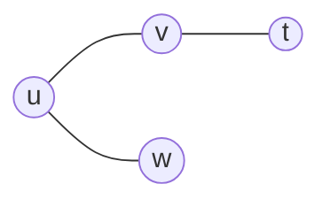
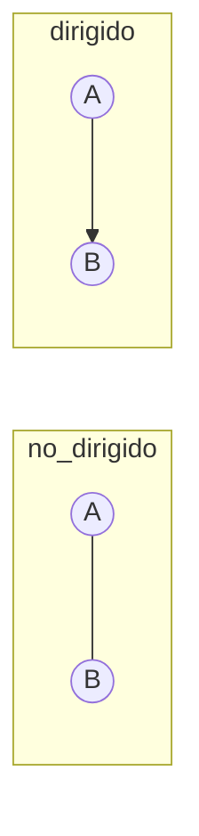
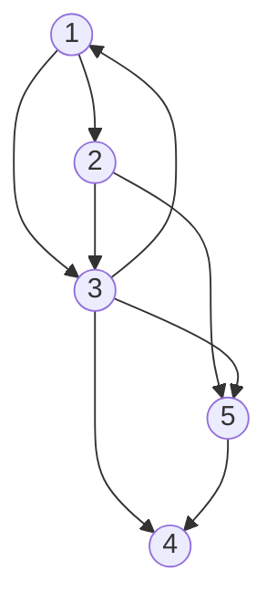
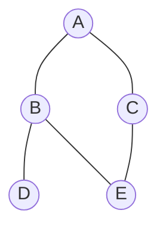

# Grafos — Repaso ultracompacto

Fuente: `sem13/teoS13Grafos v2.pdf`, `sem14/teoS14GrafosAlgo.pdf`, labs DFS/BFS/Dijkstra, PC04.

Tema más importante del examen. Paso a paso.

---

## 1. ¿Qué es un grafo?

**Qué es:** `G = (V, A)`  
- **V** = vértices (nodos)  
- **A** = aristas (conexiones entre pares de vértices)

**Para qué:** modelar **relaciones** (rutas, redes, dependencias, web, circuitos).

**Cuándo:** cuando el problema no es lineal ni simplemente jerárquico (un árbol es un grafo especial: conectado y sin ciclos).



---

## 2. Vocabulario

| Término | Definición |
|---------|------------|
| **Vértice** | nodo / ente |
| **Arista** | enlace entre dos vértices |
| **Peso** | costo numérico de una arista (distancia, tiempo, …) |
| **Adyacentes** | vértices unidos por una arista |
| **Grado** | nº de aristas incidentes en un vértice |
| **Camino** | secuencia de aristas entre vértices adyacentes |
| **Ciclo** | camino que vuelve al inicio |
| **Denso** | muchas aristas (≈ V²) → conviene **matriz** |
| **Disperso / sparse** | pocas aristas (≈ V) → conviene **lista** |

**Máximo de aristas:**
- Dirigido simple: `n(n−1)`
- No dirigido simple: `n(n−1)/2`

---

## 3. Dirigido vs no dirigido

| | No dirigido | Dirigido (digrafo) |
|--|-------------|---------------------|
| Arista | bidireccional `u—v` | sentido `u→v` |
| Matriz | **simétrica** M[i][j]=M[j][i] | no simétrica |
| En lista | se agrega en ambos extremos | solo origen → destino |



**Grafo con pesos:** cada arista tiene `w ≥ 0` (en Dijkstra del curso).  
Costo de un camino = suma de pesos de sus aristas.

---

## 4. Representación

### 4.1 Matriz de adyacencia

Tabla `N × N`:
- sin peso: `1` si hay arista, `0` si no  
- con peso: el costo; `0` (o ∞) si no hay arista

```
    1 2 3 4 5
1   0 1 1 0 0
2   0 0 1 0 1
3   1 0 0 1 1
4   0 0 0 0 0
5   0 0 0 1 0
```



| | Valor |
|--|-------|
| Memoria | **O(V²)** |
| ¿Existe arista (v,w)? | **O(1)** |
| Mejor para | grafos **densos** |

**Ventajas:** consulta rápida; simple.  
**Desventajas:** desperdicia memoria si hay pocas aristas.

---

### 4.2 Lista de adyacencia

Cada vértice tiene una lista de vecinos.

```
1 → 2 → 3
2 → 3 → 5
3 → 1 → 4 → 5
4 → (vacía)
5 → 4
```

En lab: arreglo de listas; si **no dirigido**, al agregar `u-v` se inserta en ambas listas.

| | Valor |
|--|-------|
| Memoria | **O(V + E)** |
| ¿Existe arista? | O(grado) / hasta O(E) |
| Mejor para | grafos **dispersos** |

**Ventajas:** ahorra memoria; natural para DFS/BFS.  
**Desventajas:** consultar “¿hay arista?” no es O(1).

---

## 5. Recorridos

Un **recorrido** visita vértices/aristas de forma sistemática. Eficiente ≈ tiempo lineal en V+E.

### 5.1 DFS — profundidad (Depth-First Search)

**Qué es:** baja por una rama **lo más profundo posible** antes de retroceder. Generaliza **PreOrden** de árboles.

**Usa:** **pila** (o recursión).

**Idea paso a paso:**
1. Marcar todos como NO_VISITADO
2. Empezar en `u`: marcar VISITADO
3. Para cada vecino no visitado → DFS recursivo
4. Al terminar vecinos → TERMINADO

**Pseudocódigo (material):**

```
DFS_Visitar(u):
  estado[u] ← VISITADO
  PARA cada v vecino de u:
    SI estado[v] = NO_VISITADO:
      padre[v] ← u
      DFS_Visitar(v)
  estado[u] ← TERMINADO
```

**Para qué / cuándo:** detectar ciclos, caminos, componentes, ordenamiento topológico, laberintos.

**Ventajas:** poca memoria (ruta actual); bueno para ciclos/topológico.  
**Desventajas:** no garantiza camino más corto; puede “irse lejos”.

**Complejidad:** O(V + E) con lista.

---

### 5.2 BFS — anchura (Breadth-First Search)

**Qué es:** visita **por niveles**. Generaliza recorrido por niveles de un árbol.

**Usa:** **cola**.

**Idea paso a paso:**
1. Marcar inicio VISITADO, distancia 0, encolar
2. Mientras cola no vacía:
   - desencolar `u`
   - para cada vecino no visitado: marcar, dist = dist(u)+1, encolar

**Pseudocódigo (material):**

```
BFS(s):
  Encolar(s); estado[s]=VISITADO; dist[s]=0
  MIENTRAS cola no vacía:
    u ← Desencolar
    PARA cada v adyacente a u:
      SI no visitado:
        visitar v; dist[v]=dist[u]+1; Encolar(v)
```

**Ejemplo (lab):** no dirigido A—B, A—C, B—D, B—E, C—E  
Desde A → BFS típico: **A B C D E** (orden depende del orden de vecinos).



**Para qué / cuándo:** camino con **mínimo nº de aristas** (sin pesos); componentes; redes.

**Ventajas:** encuentra solución “más corta” en nº de aristas; no se pierde en una rama.  
**Desventajas:** más memoria (guarda un nivel completo).

**Complejidad:** O(V + E) con lista.

---

### DFS vs BFS (chuleta)

| | DFS | BFS |
|--|-----|-----|
| Estructura | pila / recursión | **cola** |
| Orden | profundidad | niveles |
| Camino mínimo (# aristas) | no | **sí** (sin pesos) |
| Memoria | menor (ruta) | mayor (nivel) |

---

## 6. Dijkstra — camino mínimo con pesos

**Qué es:** algoritmo **voraz** para camino de **menor peso** desde un origen a los demás (pesos ≥ 0).

**Camino mínimo:** camino de menor peso.  
**Distancia:** ese peso total.

**Idea (sem14):** búsqueda en anchura **ponderada** — siempre se “cierra” el candidato no marcado con **menor distancia** conocida.

### Paso a paso

1. `dist[origen] = 0`; resto = ∞ (en lab: −1 = infinito)
2. `prev[v] = −1`; nadie marcado
3. Repetir:
   - Elegir no marcado con menor `dist` (≥ 0)
   - Para cada vecino `i` con arista:
     - si `dist[actual] + peso < dist[i]` → actualizar `dist` y `prev`
   - Marcar `actual`
4. Terminar cuando no queden candidatos
5. Reconstruir ruta con `prev` desde destino hasta origen

### Ejemplo de tabla (idea del PDF)

Partiendo de `a`, se van fijando distancias crecientes a `b, c, e, d, z` hasta obtener distancias finales (ej. a→z = 7).

### Del lab (`dijkstra.cpp`)

Etiqueta por nodo: `{nro, prev, peso, marca}`  
Matriz `A[i][j] > 0` = hay arista con ese peso.  
Mejora: si `Labels[i0].peso + A[i0][i] < Labels[i].peso` → actualizar.

**Complejidad (material):**
- Matriz / lista simple: **O(n²)**
- Con cola de prioridad: **O(n log n)** (según apunte)

**Ventajas:** camino óptimo con pesos no negativos; muy usado (GPS, redes).  
**Desventajas:** no sirve bien con pesos negativos (eso es otro algoritmo); O(n²) sin heap.

**Cuándo:** “ruta más barata / corta en distancia/tiempo” entre ciudades, etc.  
**Errores:**
- Usar Dijkstra con pesos negativos
- Olvidar marcar nodos
- No actualizar `prev` al mejorar distancia
- Confundir BFS (aristas) con Dijkstra (pesos)

---

## 7. Otros algoritmos del material (solo saber que existen)

| Algoritmo | Para qué |
|-----------|----------|
| Floyd | caminos mínimos **entre todos** los pares |
| Warshall | cierre transitivo (alcanzabilidad) |
| Prim / Kruskal | árbol de cubrimiento de **costo mínimo** |

Para el examen, prioriza: **representación + DFS + BFS + Dijkstra**.

---

## 8. Casos típicos de examen

1. Dibujar matriz y/o lista de un grafo dado  
2. ¿Dirigido o no? ¿simétrica la matriz?  
3. Traza BFS y DFS desde un vértice  
4. ¿Matriz o lista? (denso vs disperso)  
5. Dijkstra a mano: tabla de distancias + ruta final  
6. Relacionar cola ↔ BFS, pila ↔ DFS  

---

## 9. Errores frecuentes

| Error | Detalle |
|-------|---------|
| Olvidar arista inversa en no dirigido | lista/matriz incompleta |
| Confundir DFS y BFS | estructura auxiliar distinta |
| Pensar que DFS da camino más corto | solo BFS (sin pesos) / Dijkstra (con pesos) |
| Matriz en grafo enorme y disperso | memoria O(V²) innecesaria |
| En Dijkstra: no marcar / no mejorar dist | ruta incorrecta |

---

## Chuleta de 30 segundos

```
G = (V, A)
Denso → matriz O(V²) · Disperso → lista O(V+E)
DFS = pila/recursión · BFS = cola
BFS → mín. aristas · Dijkstra → mín. peso (≥0)
No dirigido → matriz simétrica / aristas en ambos lados
```
