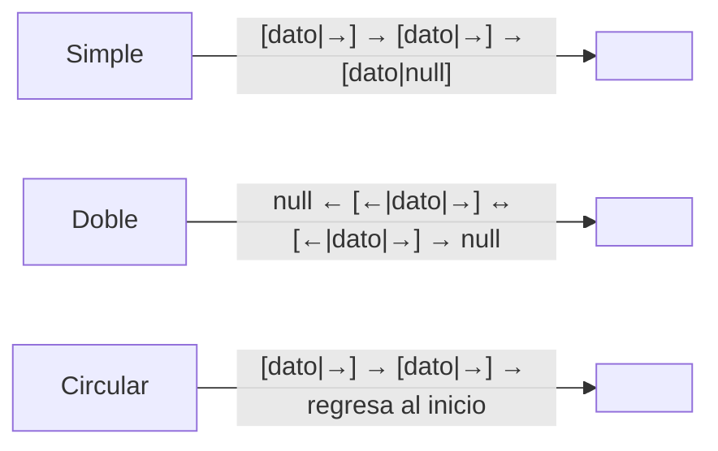
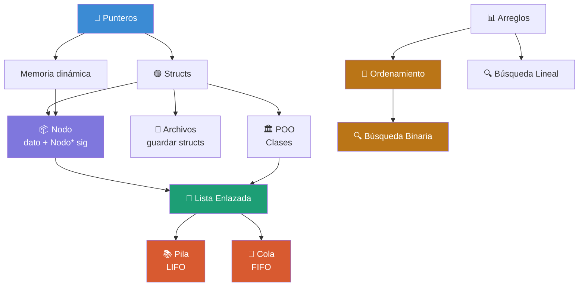

# 📚 GUÍA MAESTRA DE REPASO — ESTRUCTURA DE DATOS
> **Examen Parcial** | Teoría hasta **COLAS** | Práctica hasta **PILAS**

---

## Índice

1. [Punteros](#1-punteros)
2. [Structs](#2-structs)
3. [Archivos y Persistencia](#3-archivos-y-persistencia)
4. [Programación Orientada a Objetos](#4-programación-orientada-a-objetos)
5. [Métodos de Ordenamiento](#5-métodos-de-ordenamiento)
6. [Métodos de Búsqueda](#6-métodos-de-búsqueda)
7. [Listas Enlazadas](#7-listas-enlazadas)
8. [Pilas](#8-pilas-stacks)
9. [Colas](#9-colas-queues)
10. [Tabla Comparativa](#10-tabla-comparativa-de-estructuras)
11. [Complejidades Temporales](#11-complejidades-temporales)
12. [Preguntas Teóricas Probables](#12-preguntas-teóricas-más-probables)
13. [Memorizar vs. Comprender](#13-qué-debes-memorizar-vs-comprender)
14. [⏱️ Repaso 15 minutos](#14-️-repaso-rápido-15-minutos)
15. [🔥 Repaso 5 minutos](#15--repaso-extremo-5-minutos)
16. [Probabilidad en Examen](#16-probabilidad-de-aparición-en-examen)
17. [Mapa de Dependencias](#17-mapa-de-dependencias-entre-temas)

---

## 1. Punteros

### Idea principal
Un puntero es una variable que almacena la **dirección de memoria** donde vive otro dato, no el dato en sí.

### ¿Para qué sirve?
- Acceder y modificar variables desde distintas partes del programa.
- Crear estructuras de datos dinámicas (listas, pilas, colas, árboles).
- Pasar datos grandes a funciones sin copiarlos (paso por referencia).
- Manejar arreglos dinámicos cuyo tamaño no se conoce en compilación.

### Cómo funciona internamente
La RAM es una secuencia de celdas numeradas. Cada variable tiene una dirección. Un puntero guarda ese número.

```
int x = 42;   →  dirección 0x1000, valor 42
int* p = &x;  →  p guarda 0x1000
*p = 100;     →  cambia el valor en 0x1000, es decir, cambia x
```

**Operadores clave:**

| Operador | Significado |
|----------|-------------|
| `&var` | "dame la dirección de esta variable" |
| `*ptr` | "dame el valor en esa dirección" (desreferencia) |

### Memoria dinámica

```cpp
int* p = new int;    // reserva espacio en el heap
*p = 50;
delete p;            // libera la memoria (OBLIGATORIO)
p = nullptr;         // evita puntero colgante

int* arr = new int[10]; // arreglo dinámico
delete[] arr;           // se libera con delete[]
```

### Operaciones importantes

```cpp
int* p;          // Declaración
p = &x;          // Asignación
*p               // Desreferencia
p++              // Aritmética: avanza al siguiente elemento del tipo
p == nullptr     // Comparación: verificar puntero nulo
```

### Ventajas y desventajas

| ✅ Ventajas | ❌ Desventajas |
|------------|---------------|
| Control total sobre la memoria | Errores difíciles de detectar |
| No se copian datos grandes | Punteros colgantes (dangling pointers) |
| Permite estructuras dinámicas | Punteros no inicializados → comportamiento indefinido |

### Errores comunes

> ⚠️ **Los más frecuentes en examen práctico:**

- `int* p; *p = 5;` → **CRASH** (no inicializado)
- No liberar con `delete` → **memory leak**
- `delete` sin `new`, o `delete[]` sin `new[]` → **CRASH**
- `p = nullptr; *p` → **CRASH**
- Doble liberación: `delete p; delete p;` → **CRASH**

### Relación con otros temas
> Es el **tema base de todo**. Sin punteros no hay nodos, sin nodos no hay listas, sin listas no hay pilas ni colas.

---

## 2. Structs

### Idea principal
Un struct agrupa variables de **distintos tipos** bajo un mismo nombre. Es la forma de modelar entidades del mundo real.

### ¿Para qué sirve?
- Representar objetos con múltiples atributos (Alumno, Producto, Nodo).
- Crear los **nodos** que forman listas, pilas y colas.
- Organizar datos relacionados en una sola unidad.

### Declaración y uso

```cpp
struct Alumno {
    int    codigo;
    char   nombre[50];
    float  promedio;
};

// Variable normal → usa punto (.)
Alumno a1;
a1.codigo  = 1001;
a1.promedio = 16.5;

// Puntero → usa flecha (->)
Alumno* ptr = new Alumno;
ptr->codigo  = 1002;
ptr->promedio = 14.0;
delete ptr;
```

### El Nodo: el struct más importante del curso

```cpp
struct Nodo {
    int   dato;
    Nodo* siguiente;  // puntero al próximo nodo (autorreferencia)
};
```

> Este struct **ES** el bloque de construcción de listas, pilas y colas.

### Errores comunes

- Usar `.` en vez de `->` con punteros al struct (o viceversa).
- Olvidar `siguiente = nullptr` al crear un nuevo nodo.
- Olvidar el `;` al cerrar la declaración del struct.

### Relación con otros temas
> Struct + Puntero = **Nodo**. Un Nodo autorreferenciado es la base de todas las estructuras dinámicas.

---

## 3. Archivos y Persistencia

### Idea principal
**Persistencia** = los datos sobreviven al cierre del programa. Los archivos en disco son el mecanismo estándar.

### Tipos de archivos

| Tipo | Legible | Velocidad | Función de escritura | Función de lectura |
|------|---------|-----------|---------------------|--------------------|
| Texto | Sí | Más lento | `<<` | `>>` / `getline` |
| Binario | No | Más rápido | `write()` | `read()` |

### Archivos de texto

```cpp
// Escribir
ofstream f("datos.txt");
f << "Juan" << " " << 18 << endl;
f.close();

// Leer
ifstream g("datos.txt");
string nombre; int nota;
while (g >> nombre >> nota) {
    cout << nombre << ": " << nota << endl;
}
g.close();
```

### Archivos binarios (guardar structs)

```cpp
// Guardar
Alumno a = {1001, "Pedro", 15.5};
ofstream f("alumnos.bin", ios::binary);
f.write((char*)&a, sizeof(Alumno));
f.close();

// Leer
Alumno b;
ifstream g("alumnos.bin", ios::binary);
g.read((char*)&b, sizeof(Alumno));
g.close();
```

### Modos de apertura

| Modo | Significado |
|------|-------------|
| `ios::in` | Leer |
| `ios::out` | Escribir (borra contenido previo) |
| `ios::app` | Agregar al final |
| `ios::binary` | Modo binario |

### Errores comunes

- No verificar si el archivo abrió: `if (!f.is_open()) { ... }`
- Olvidar `f.close()` → puede perder datos (buffer no vaciado)
- Usar `ios::out` sin `ios::app` y borrar datos sin querer

---

## 4. Programación Orientada a Objetos

### Conceptos clave

```cpp
class Alumno {
private:                          // solo accesible dentro de la clase
    int    codigo;
    string nombre;
    float  promedio;

public:                           // accesible desde cualquier parte
    Alumno(int c, string n, float p); // constructor
    ~Alumno();                        // destructor
    int   getCodigo()  { return codigo; }
    void  setNombre(string n) { nombre = n; }
    void  mostrar();
};

// Crear objeto
Alumno a1(1001, "Maria", 16.5);
a1.mostrar();
```

### Los 4 pilares

| Pilar | Qué es | Ejemplo |
|-------|--------|---------|
| **Encapsulamiento** | Atributos `private`, acceso por getters/setters | `getCodigo()` |
| **Abstracción** | Ocultar la implementación interna | El usuario usa `mostrar()` sin saber cómo funciona |
| **Herencia** | Clase hija reutiliza clase padre | `class Estudiante : public Alumno` |
| **Polimorfismo** | Mismo método, distinto comportamiento | Funciones `virtual` |

### Struct vs Clase

| | Struct | Clase |
|--|--------|-------|
| Campos por defecto | `public` | `private` |
| Métodos | Solo en C++ | Sí |
| Constructor/Destructor | Solo en C++ | Sí |
| Uso típico | Nodo simple, dato puro | Estructura completa con lógica |

### Errores comunes

- Olvidar el destructor cuando se usa memoria dinámica → memory leak
- Constructor sin tipo de retorno (no es una función normal)
- Acceder a atributo `private` desde fuera de la clase
- Olvidar `;` al cerrar la declaración de la clase

---

## 5. Métodos de Ordenamiento

### Burbuja (Bubble Sort)

**Idea:** Compara pares adyacentes e intercambia si están en el orden equivocado. El mayor "burbujea" hacia el final en cada pasada.

```cpp
for (int i = 0; i < n-1; i++) {
    for (int j = 0; j < n-1-i; j++) {
        if (arr[j] > arr[j+1]) {
            swap(arr[j], arr[j+1]);
        }
    }
}
```

### Selección (Selection Sort)

**Idea:** Busca el mínimo del subarreglo no ordenado y lo pone en su posición correcta.

```cpp
for (int i = 0; i < n-1; i++) {
    int minIdx = i;
    for (int j = i+1; j < n; j++) {
        if (arr[j] < arr[minIdx]) minIdx = j;
    }
    swap(arr[i], arr[minIdx]);
}
```

### Inserción (Insertion Sort)

**Idea:** Como ordenar cartas en la mano. Toma un elemento y lo inserta en la posición correcta dentro del subarreglo ya ordenado.

```cpp
for (int i = 1; i < n; i++) {
    int clave = arr[i];
    int j = i - 1;
    while (j >= 0 && arr[j] > clave) {
        arr[j+1] = arr[j];
        j--;
    }
    arr[j+1] = clave;
}
```

### Complejidades comparadas

| Algoritmo | Mejor caso | Caso promedio | Peor caso | Estable |
|-----------|-----------|--------------|-----------|---------|
| Burbuja | O(n) | O(n²) | O(n²) | ✅ Sí |
| Selección | O(n²) | O(n²) | O(n²) | ❌ No |
| Inserción | **O(n)** | O(n²) | O(n²) | ✅ Sí |
| QuickSort | O(n log n) | O(n log n) | O(n²) | ❌ No |
| MergeSort | O(n log n) | O(n log n) | O(n log n) | ✅ Sí |

> 💡 **Inserción es el mejor** de los tres cuadráticos cuando los datos están casi ordenados.

### Errores comunes

- Off-by-one: el `for` llega hasta `n` en vez de `n-1`
- No usar variable temporal al intercambiar (o simplemente usa `swap`)
- Confundir cuál algoritmo hace qué

---

## 6. Métodos de Búsqueda

### Búsqueda Lineal

**Idea:** Recorre uno a uno comparando con el objetivo. No requiere orden.

```cpp
int buscarLineal(int arr[], int n, int objetivo) {
    for (int i = 0; i < n; i++) {
        if (arr[i] == objetivo) return i;
    }
    return -1;
}
```

### Búsqueda Binaria

**Idea:** Divide el espacio de búsqueda a la mitad en cada paso. **REQUIERE datos ordenados.**

```cpp
int buscarBinaria(int arr[], int n, int objetivo) {
    int inicio = 0, fin = n - 1;
    while (inicio <= fin) {
        int medio = (inicio + fin) / 2;
        if      (arr[medio] == objetivo) return medio;
        else if (arr[medio] <  objetivo) inicio = medio + 1;
        else                             fin    = medio - 1;
    }
    return -1;
}
```

### Comparación

| | Lineal | Binaria |
|--|--------|---------|
| Complejidad | O(n) | O(log n) |
| Requiere orden | ❌ No | ✅ **Sí** |
| Simples de implementar | ✅ | Media |
| n = 1,000,000 | hasta 1,000,000 pasos | máx. **20 pasos** |

> ⚠️ **Error fatal:** aplicar Búsqueda Binaria a datos NO ordenados → resultados incorrectos sin crash.

---

## 7. Listas Enlazadas

### Idea principal
Colección de **nodos** donde cada nodo tiene un dato y un puntero al siguiente. Los nodos NO están contiguos en memoria.

```
cabeza → [5|→] → [3|→] → [8|null]
```

### Tipos



### Operaciones con código

**Insertar al inicio — O(1)**
```cpp
Nodo* nuevo = new Nodo;
nuevo->dato = valor;
nuevo->siguiente = cabeza;
cabeza = nuevo;
```

**Insertar al final — O(n)**
```cpp
Nodo* nuevo = new Nodo;
nuevo->dato = valor;
nuevo->siguiente = nullptr;
if (cabeza == nullptr) { cabeza = nuevo; return; }
Nodo* temp = cabeza;
while (temp->siguiente != nullptr) temp = temp->siguiente;
temp->siguiente = nuevo;
```

**Eliminar al inicio — O(1)**
```cpp
if (cabeza == nullptr) return;
Nodo* temp = cabeza;
cabeza = cabeza->siguiente;
delete temp;
```

**Recorrer — O(n)**
```cpp
Nodo* temp = cabeza;
while (temp != nullptr) {
    cout << temp->dato << " ";
    temp = temp->siguiente;
}
```

### Ventajas y desventajas

| ✅ Ventajas | ❌ Desventajas |
|------------|---------------|
| Tamaño dinámico | Acceso secuencial O(n), no aleatorio |
| Insertar/eliminar al inicio en O(1) | Memoria extra por cada puntero |
| No desperdicia memoria | No permite Búsqueda Binaria |

### Errores comunes

- No poner `nuevo->siguiente = nullptr`
- No guardar referencia antes de mover `cabeza` al eliminar
- No hacer `delete` al eliminar → memory leak
- Acceder a nodo nulo sin verificar: siempre `if (temp != nullptr)`

---

## 8. Pilas (Stacks)

### Idea principal
**LIFO** — Last In, First Out. Solo se opera en el **TOPE**.

```
push(1) → [1]
push(2) → [1, 2]  ← tope
push(3) → [1, 2, 3]  ← tope
pop()   → [1, 2]  retorna 3
```

### Implementación con arreglo

```cpp
const int MAX = 100;
int pila[MAX];
int tope = -1;

void push(int valor) {
    if (tope >= MAX-1) { cout << "Pila llena"; return; }
    pila[++tope] = valor;
}

int pop() {
    if (tope < 0) { cout << "Pila vacía"; return -1; }
    return pila[tope--];
}

int  top()       { return pila[tope]; }
bool estaVacia() { return tope == -1; }
bool estaLlena() { return tope == MAX-1; }
```

### Implementación con lista enlazada

```cpp
struct Nodo { int dato; Nodo* siguiente; };
Nodo* tope = nullptr;

void push(int valor) {
    Nodo* nuevo = new Nodo;
    nuevo->dato = valor;
    nuevo->siguiente = tope;
    tope = nuevo;
}

int pop() {
    if (tope == nullptr) { cout << "Vacía"; return -1; }
    Nodo* temp = tope;
    int val = temp->dato;
    tope = tope->siguiente;
    delete temp;
    return val;
}
```

### Complejidades

| Operación | Complejidad |
|-----------|-------------|
| `push(x)` | **O(1)** |
| `pop()` | **O(1)** |
| `peek()/top()` | **O(1)** |
| `isEmpty()` | **O(1)** |

> ✅ **Todas las operaciones básicas son O(1).**

### Aplicaciones reales

- Ctrl+Z (deshacer acciones)
- Llamadas a funciones recursivas (pila del sistema operativo)
- Verificación de paréntesis balanceados
- Botón "Atrás" del navegador

### Errores comunes

- **Stack Overflow:** `push` sin verificar si está llena
- **Stack Underflow:** `pop`/`peek` en pila vacía → crash
- Olvidar `delete` en `pop()` con lista enlazada

---

## 9. Colas (Queues)

> 📌 **La parte TEÓRICA del examen llega hasta aquí.**

### Idea principal
**FIFO** — First In, First Out. Entra por el **FINAL**, sale por el **FRENTE**.

```
enqueue(1) → [1]         frente=1, final=1
enqueue(2) → [1, 2]      frente=1, final=2
enqueue(3) → [1, 2, 3]   frente=1, final=3
dequeue()  → [2, 3]      retorna 1
```

### Pila vs Cola (la diferencia fundamental)

| | Pila | Cola |
|--|------|------|
| Política | **LIFO** | **FIFO** |
| Entra por | el tope | el final |
| Sale por | el tope | el frente |
| Extremos | uno | dos |

### Implementación con arreglo circular

```cpp
const int MAX = 5;
int cola[MAX];
int frente = 0, final_cola = 0, tam = 0;

void enqueue(int valor) {
    if (tam == MAX) { cout << "Llena"; return; }
    cola[final_cola] = valor;
    final_cola = (final_cola + 1) % MAX;  // clave: módulo para circular
    tam++;
}

int dequeue() {
    if (tam == 0) { cout << "Vacía"; return -1; }
    int val = cola[frente];
    frente = (frente + 1) % MAX;
    tam--;
    return val;
}

bool estaVacia() { return tam == 0; }
bool estaLlena() { return tam == MAX; }
```

### Implementación con lista enlazada

```cpp
struct Nodo { int dato; Nodo* siguiente; };
Nodo* frente    = nullptr;
Nodo* finalCola = nullptr;

void enqueue(int valor) {
    Nodo* nuevo = new Nodo;
    nuevo->dato = valor;
    nuevo->siguiente = nullptr;
    if (finalCola == nullptr) { frente = finalCola = nuevo; return; }
    finalCola->siguiente = nuevo;
    finalCola = nuevo;
}

int dequeue() {
    if (frente == nullptr) { cout << "Vacía"; return -1; }
    Nodo* temp = frente;
    int val = temp->dato;
    frente = frente->siguiente;
    if (frente == nullptr) finalCola = nullptr; // ← NO olvidar esto
    delete temp;
    return val;
}
```

### Complejidades

| Operación | Complejidad |
|-----------|-------------|
| `enqueue(x)` | **O(1)** |
| `dequeue()` | **O(1)** |
| `front()` | **O(1)** |
| `isEmpty()` | **O(1)** |

### Errores comunes

- Confundir frente y final (enqueue en frente → MAL)
- **Olvidar `finalCola = nullptr` cuando la cola queda vacía** (error muy frecuente)
- No usar `% MAX` en la cola circular

### Aplicaciones reales

- Cola de impresión
- Planificador de procesos del SO (CPU scheduling)
- Buffers de red
- Simulaciones de fila (banco, supermercado)

---

## 10. Tabla Comparativa de Estructuras

| Estructura | Política | Acceso | Insertar | Eliminar | Buscar | Tamaño |
|------------|----------|--------|----------|----------|--------|--------|
| Arreglo | Libre | O(1) | O(n)* | O(n)* | O(n)/O(log n)** | Fijo |
| Lista enlazada | Libre | O(n) | O(1)*** | O(1)*** | O(n) | Dinámico |
| Pila | **LIFO** | O(1)† | O(1) | O(1) | O(n) | Dep. |
| Cola | **FIFO** | O(1)†† | O(1) | O(1) | O(n) | Dep. |

*Al inicio/final O(1); en el medio O(n) por desplazamiento.
**O(log n) solo si está ordenado (Búsqueda Binaria).
***Al inicio O(1); al final/medio O(n) para llegar ahí.
†Solo al tope.
††Solo al frente.

---

## 11. Complejidades Temporales

### Ordenamiento

| Algoritmo | Mejor | Promedio | Peor |
|-----------|-------|----------|------|
| Burbuja | O(n) | O(n²) | O(n²) |
| Selección | O(n²) | O(n²) | O(n²) |
| Inserción | **O(n)** | O(n²) | O(n²) |
| QuickSort | O(n log n) | O(n log n) | O(n²) |
| MergeSort | O(n log n) | O(n log n) | O(n log n) |

### Búsqueda

| Algoritmo | Complejidad | Requisito |
|-----------|-------------|-----------|
| Lineal | O(n) | Ninguno |
| Binaria | **O(log n)** | Datos ordenados |

### Lista Enlazada

| Operación | Complejidad |
|-----------|-------------|
| Insertar al inicio | O(1) |
| Insertar al final | O(n) |
| Eliminar al inicio | O(1) |
| Eliminar al final | O(n) |
| Buscar | O(n) |

### Jerarquía de eficiencia

```
O(1) < O(log n) < O(n) < O(n log n) < O(n²) < O(2ⁿ) < O(n!)
MEJOR ─────────────────────────────────────────────── PEOR
```

---

## 12. Preguntas Teóricas más Probables

### Punteros
1. ¿Qué es un puntero? ¿En qué se diferencia de una variable normal?
2. ¿Qué operadores se usan con punteros y qué hace cada uno?
3. ¿Qué es un memory leak? ¿Cómo se produce y cómo se evita?
4. ¿Qué diferencia hay entre `delete` y `delete[]`?

### Ordenamiento
5. Explica el algoritmo de Burbuja paso a paso.
6. ¿En qué caso Inserción es mejor que Burbuja?
7. ¿Qué significa que un algoritmo sea "estable"?
8. ¿Cuál es la complejidad de cada algoritmo?

### Búsqueda
9. ¿Por qué la Búsqueda Binaria requiere datos ordenados?
10. Compara Lineal vs Binaria en complejidad y aplicación.
11. Tienes 1 millón de registros. ¿Cuál usas? ¿Por qué?

### Listas
12. ¿Qué es una lista enlazada? ¿En qué se diferencia de un arreglo?
13. ¿Por qué insertar al inicio es O(1) y al final es O(n)?
14. ¿Qué tipos de listas existen y en qué se diferencian?

### Pilas
15. ¿Qué significa LIFO? Ejemplo real.
16. ¿Cuáles son las operaciones de una pila y su complejidad?
17. ¿Qué es stack overflow y stack underflow?
18. Nombra 3 aplicaciones reales de una pila.

### Colas
19. ¿Qué significa FIFO? ¿En qué se diferencia de LIFO?
20. ¿Por qué se necesita una cola circular en vez de una lineal?
21. ¿Qué pasa con el puntero `final` si la cola queda vacía?
22. Nombra 3 aplicaciones reales de una cola.

---

## 13. Qué debes Memorizar vs. Comprender

### 🧠 Memorizar (definiciones exactas)

| Término | Definición |
|---------|------------|
| Puntero | Variable que almacena una dirección de memoria |
| Struct | Tipo de dato que agrupa variables de distintos tipos |
| LIFO | Last In, First Out → Pila |
| FIFO | First In, First Out → Cola |
| O(1) | Tiempo constante, no depende del tamaño |
| O(n) | Tiempo lineal, crece proporcional a n |
| O(log n) | Tiempo logarítmico, divide el problema a la mitad |
| O(n²) | Tiempo cuadrático, bucle anidado sobre los datos |

### 🧠 Memorizar (operadores y nombres)

| | Símbolo/Nombre |
|--|----------------|
| Dirección de | `&` |
| Desreferencia | `*` |
| Acceso por puntero | `->` |
| Acceso por variable | `.` |
| Pila: meter | `push` |
| Pila: sacar | `pop` |
| Pila: ver tope | `peek` / `top` |
| Cola: meter | `enqueue` |
| Cola: sacar | `dequeue` |
| Cola: ver frente | `front` |

### 💡 Comprender (no basta con memorizarlo)

1. **Por qué un puntero no inicializado es peligroso** — apunta a una dirección aleatoria; leer o escribir ahí es comportamiento indefinido.
2. **Por qué la Búsqueda Binaria requiere orden** — asume que si el buscado es mayor que el medio, todos los menores también lo son. Eso solo es válido si el arreglo está ordenado.
3. **Por qué la lista no permite acceso aleatorio** — los nodos no son contiguos. Para llegar al nodo 7, debes seguir 7 punteros desde la cabeza.
4. **Por qué todas las operaciones de Pila y Cola son O(1)** — siempre operan sobre el mismo extremo. No recorren nada.
5. **Por qué la cola circular resuelve el desperdicio** — con `% MAX`, los índices dan la vuelta y reutilizan el espacio liberado al inicio.

---

## 14. ⏱️ Repaso Rápido 15 minutos

### Minutos 1–2: Punteros y Structs
- Puntero = dirección. `&` da dirección. `*` da valor. `new`/`delete`.
- Struct: agrupa campos. `.` para variable, `->` para puntero.
- Nodo = struct con `dato` + `Nodo* siguiente`. Base de todo.

### Minutos 3–4: Archivos
- `ofstream` escribir. `ifstream` leer. Texto: `<<`/`>>`. Binario: `write()`/`read()`.
- Siempre verificar apertura. Siempre `f.close()`. `ios::app` agrega al final.

### Minuto 5: POO
- Clase = struct + métodos + encapsulamiento. `private`/`public`/`protected`.
- Constructor inicializa. Destructor libera (`~Nombre`). Herencia: `class Hijo : public Padre`.

### Minutos 6–7: Ordenamiento
- Burbuja: compara adyacentes, intercambia si mayor > siguiente. **O(n²)**.
- Selección: encuentra el mínimo, lo pone en su lugar. **O(n²)** siempre.
- Inserción: inserta en posición correcta. **O(n) mejor caso**.

### Minuto 8: Búsqueda
- Lineal: uno a uno, **O(n)**, cualquier arreglo.
- Binaria: por mitades, **O(log n)**, **REQUIERE ORDEN**.
- n=1M: lineal → 1M pasos; binaria → 20 pasos máx.

### Minutos 9–10: Lista Enlazada
- Inicio: **O(1)**. Final: **O(n)**. Buscar: **O(n)**.
- Siempre: `nuevo->siguiente = nullptr`. Siempre: verificar `!= nullptr`. Siempre: `delete` al eliminar.

### Minutos 11–12: Pilas
- **LIFO**. Solo opera en el TOPE. `push`/`pop`/`peek`/`isEmpty`. Todas **O(1)**.
- Arreglo: `tope = -1`. Lista: `tope = nullptr`.
- Apps: deshacer, recursión, paréntesis, navegador.

### Minutos 13–14: Colas
- **FIFO**. Entra al FINAL, sale del FRENTE. Todas **O(1)**.
- Cola circular: usa `% MAX`. Con lista: dos punteros (`frente` y `final`).
- Si queda vacía: **actualizar ambos punteros a `nullptr`**.

### Minuto 15: Tabla de Oro
```
LIFO = Pila | FIFO = Cola
O(1) < O(log n) < O(n) < O(n log n) < O(n²)
Arreglo: acceso rápido, tamaño fijo
Lista:   dinámico, sin acceso aleatorio
Binaria: SOLO con datos ORDENADOS
```

---

## 15. 🔥 Repaso Extremo 5 minutos

```
PUNTEROS  → & dirección | * desreferencia | new/delete heap | nullptr = seguro
STRUCTS   → agrupa campos | . variable | -> puntero | Nodo = {dato, Nodo* sig}
ARCHIVOS  → ofstream escribir | ifstream leer | binario: write/read | cerrar siempre
POO       → private+métodos | constructor/destructor | herencia | polimorfismo

ORDEN:    Burbuja = Selección = Inserción = O(n²)
          Inserción mejor caso O(n) | Quick/Merge = O(n log n)

BÚSQUEDA: Lineal O(n) siempre | Binaria O(log n) SOLO SI ORDENADO

LISTA:    Inicio O(1) | Final O(n) | Buscar O(n) | Sin acceso aleatorio

PILA:     LIFO | push/pop/peek = O(1) | tope=-1 (arr) | tope=null (lista)

COLA:     FIFO | enqueue/dequeue/front = O(1) | % MAX circular
          Si vacía → frente Y final = nullptr
```

### Tabla de Oro Final

| Estructura | Política | Insertar | Eliminar | Buscar |
|------------|----------|----------|----------|--------|
| Arreglo | Libre | O(1)/O(n) | O(1)/O(n) | O(n)/O(log n) |
| Lista | Libre | O(1)* | O(1)* | O(n) |
| Pila | **LIFO** | O(1) | O(1) | O(n) |
| Cola | **FIFO** | O(1) | O(1) | O(n) |

*Al inicio.

---

## 16. Probabilidad de Aparición en Examen

| Probabilidad | Tema |
|-------------|------|
| ⭐⭐⭐⭐⭐ | Listas Enlazadas — operaciones, código, comparación |
| ⭐⭐⭐⭐⭐ | Pilas — LIFO, operaciones, implementación (práctica) |
| ⭐⭐⭐⭐⭐ | Colas — FIFO, diferencia con pila (teórica) |
| ⭐⭐⭐⭐⭐ | Complejidades O(n), O(log n), O(n²), O(n log n) |
| ⭐⭐⭐⭐⭐ | Punteros — declaración, desreferencia, new/delete |
| ⭐⭐⭐⭐ | Métodos de Ordenamiento — qué hace cada uno, complejidades |
| ⭐⭐⭐⭐ | Búsqueda Binaria vs Lineal — cuándo y por qué |
| ⭐⭐⭐⭐ | Structs y Nodos — Nodo autorreferenciado |
| ⭐⭐⭐ | Archivos — lectura/escritura, texto vs binario |
| ⭐⭐⭐ | POO — conceptos básicos, struct vs clase |
| ⭐⭐ | Cola circular — concepto y módulo % |
| ⭐⭐ | Tipos de listas (simple, doble, circular) |

---

## 17. Mapa de Dependencias entre Temas



### Dependencias críticas

| Para entender... | Necesitas saber... |
|------------------|-------------------|
| Nodo | Punteros + Structs |
| Lista Enlazada | Nodo |
| Pila / Cola | Lista enlazada (o arreglos) |
| Búsqueda Binaria | Ordenamiento previo |
| POO | Structs (es su evolución) |

> **Regla de oro:** Si no entiendes un tema, revisa el anterior en esta cadena. Los temas no son independientes.

---

*Generado como guía de estudio para examen parcial de Estructura de Datos.*
*Teoría hasta Colas | Práctica hasta Pilas*