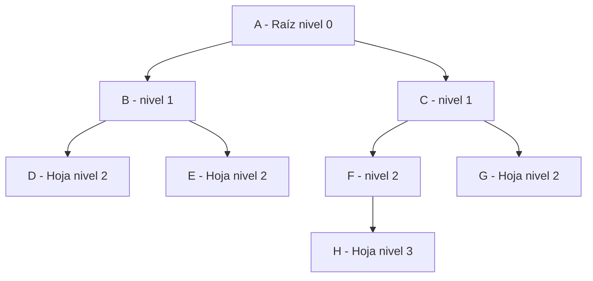

# TEMA 10: ÁRBOLES (NUEVO — PC3)

---

## 1. TEORÍA CLARA

### ¿Qué es un árbol?
Un árbol es una estructura de datos **no lineal** jerárquica formada por nodos conectados por aristas. Tiene un nodo especial llamado **raíz** y cada nodo puede tener cero o más hijos.

### ¿Para qué sirve?
- Búsqueda eficiente — O(log n) en árboles balanceados vs O(n) en listas.
- Representar jerarquías (directorios, organigramas, DOM HTML).
- Expresiones aritméticas (nodos internos = operadores, hojas = operandos).
- Árboles de decisión, diccionarios (Trie), compresión de datos (Huffman).

### Terminología esencial (del material del profesor)

| Término | Definición |
|---------|-----------|
| **Raíz** | Nodo sin padre. Es el nodo de nivel 0. |
| **Padre** | Nodo que tiene hijos. |
| **Hijo** | Nodo conectado a otro nodo de nivel superior. |
| **Hoja** | Nodo sin hijos (nodo terminal). |
| **Nodo interno** | Nodo que NO es hoja (tiene al menos un hijo). |
| **Nivel** | Distancia desde la raíz. Raíz = nivel 0. |
| **Altura** | Nivel máximo del árbol (longitud del camino más largo raíz→hoja). |
| **Grado de un nodo** | Número de hijos que tiene. Hojas tienen grado 0. |
| **Grado del árbol** | Máximo grado entre todos sus nodos. |
| **Peso** | Número de hojas del árbol. |
| **Momento** | Número total de nodos del árbol. |
| **Subárbol** | Árbol formado por un nodo y todos sus descendientes. |

### Diagrama de un árbol



En este árbol: Altura=3, Peso=4 (hojas: D,E,G,H), Momento=8, Grado del árbol=2.

### Tipos de árboles vistos en clase

| Tipo | Descripción |
|------|------------|
| **N-ario** | Cada nodo puede tener hasta N hijos. |
| **Binario** | Caso especial: máximo 2 hijos (izquierdo y derecho). |
| **ABB (Árbol Binario de Búsqueda)** | Binario ordenado: izq < raíz < der. |
| **Árbol 2-3** | N-ario de orden 3 con 1 o 2 elementos por nodo. Todas las hojas al mismo nivel. |
| **Trie** | N-ario para representar conjuntos grandes de palabras (diccionarios). |
| **Huffman** | Binario para compresión de datos basado en frecuencias de símbolos. |

---

## 2. ESTRUCTURA DEL NODO

### Árbol binario

**Pseudocódigo:**
```
REGISTRO NODO
   NODO *hi        // hijo izquierdo
   TD info
   NODO *hd        // hijo derecho
FIN_REGISTRO
```

**C/C++:**
```cpp
typedef char TD;
struct NODO {
    TD info;
    NODO *izq;    // hijo izquierdo
    NODO *der;    // hijo derecho
};
```

### Creación de nodos

**C/C++ (del laboratorio del curso):**
```cpp
void insertarIzq(NODO *p, TD dato) {
    NODO *neo = new NODO;
    neo->info = dato;
    neo->izq = NULL;
    neo->der = NULL;
    p->izq = neo;
}

void insertarDer(NODO *p, TD dato) {
    NODO *neo = new NODO;
    neo->info = dato;
    neo->izq = NULL;
    neo->der = NULL;
    p->der = neo;
}
```

---

## 3. RECORRIDOS EN PROFUNDIDAD (lo más importante para el examen)

Los tres recorridos recursivos se diferencian en **cuándo se visita la raíz**:

| Recorrido | Orden | Regla nemotécnica |
|-----------|-------|-------------------|
| **PreOrden** | **Raíz** → Izq → Der | **R**ID — "Raíz primero" |
| **InOrden** | Izq → **Raíz** → Der | I**R**D — "Raíz en medio" |
| **PostOrden** | Izq → Der → **Raíz** | ID**R** — "Raíz al final" |

### Ejemplo con árbol

```
        40
       /  \
      30    45
     /     /  \
    27    35   60
          \
          38
```

- **PreOrden:** 40, 30, 27, 45, 35, 38, 60
- **InOrden:** 27, 30, 40, 35, 38, 45, 60 ← ¡sale ORDENADO en un ABB!
- **PostOrden:** 27, 30, 38, 35, 60, 45, 40

### Implementación recursiva

**Pseudocódigo (del material del profesor):**
```
ACCION preOrden(BNODO n)
   SI(n ≠ NULL)
      ESCRIBIR(n.val)
      preOrden(n.hi)
      preOrden(n.hd)
   FIN_SI
FIN_ACCION

ACCION inOrden(BNODO n)
   SI(n ≠ NULL)
      inOrden(n.hi)
      ESCRIBIR(n.val)
      inOrden(n.hd)
   FIN_SI
FIN_ACCION

ACCION postOrden(BNODO n)
   SI(n ≠ NULL)
      postOrden(n.hi)
      postOrden(n.hd)
      ESCRIBIR(n.val)
   FIN_SI
FIN_ACCION
```

**C/C++:**
```cpp
void preOrden(NODO *raiz) {
    if (raiz != NULL) {
        printf("%3c", raiz->info);   // visitar RAÍZ
        preOrden(raiz->izq);          // recorrer izquierda
        preOrden(raiz->der);          // recorrer derecha
    }
}

void inOrden(NODO *raiz) {
    if (raiz != NULL) {
        inOrden(raiz->izq);
        printf("%3c", raiz->info);
        inOrden(raiz->der);
    }
}

void posOrden(NODO *raiz) {
    if (raiz != NULL) {
        posOrden(raiz->izq);
        posOrden(raiz->der);
        printf("%3c", raiz->info);
    }
}
```

**Cómo traducir:** La estructura es idéntica. Solo cambia `n.hi`→`raiz->izq`, `ESCRIBIR`→`printf`, y `SI(n≠NULL)`→`if(raiz!=NULL)`.

---

## 4. RECORRIDO POR NIVELES (Anchura — BFS)

Usa una **COLA** para visitar nivel por nivel, de izquierda a derecha.

**Pseudocódigo (del material del profesor):**
```
ACCION porNiveles(BNODO n)
   COLA c1
   BNODO t
   SI(n ≠ NULL)
      encolar(c1, n)
      HACER
         t ← decolar(c1)
         ESCRIBIR(t.val)
         SI(t.hi ≠ NULL)
            encolar(c1, t.hi)
         FIN_SI
         SI(t.hd ≠ NULL)
            encolar(c1, t.hd)
         FIN_SI
      MIENTRAS(NO colaVacia(c1))
   FIN_SI
FIN_ACCION
```

**C/C++ (usando arreglo como cola simple):**
```cpp
void porNiveles(NODO *raiz) {
    if (raiz == NULL) return;
    
    NODO* cola[100];
    int frente = 0, final_c = 0;
    
    cola[final_c++] = raiz;
    
    while (frente < final_c) {
        NODO *t = cola[frente++];
        printf("%c ", t->info);
        
        if (t->izq != NULL) cola[final_c++] = t->izq;
        if (t->der != NULL) cola[final_c++] = t->der;
    }
}
```

**Ejemplo:** Para el árbol anterior → **Por niveles:** 40, 30, 45, 27, 35, 60, 38

> **Conexión clave:** El recorrido por niveles usa una COLA (FIFO). Los recorridos en profundidad iterativos usan una PILA. ¡Todo se conecta!

---

## 5. RECORRIDOS ITERATIVOS (con Pila)

**Pseudocódigo — PreOrden iterativo (del material del profesor):**
```
ACCION preOrdenIterativo(BNODO n)
   PILA p1
   BNODO t
   SI(n ≠ NULL)
      empilar(p1, n)
      MIENTRAS(noVacia(p1))
         depilar(p1, t)
         ESCRIBIR(t.val)
         SI(t.hd ≠ NULL)
            empilar(p1, t.hd)
         FIN_SI
         SI(t.hi ≠ NULL)
            empilar(p1, t.hi)
         FIN_SI
      FIN_MIENTRAS
   FIN_SI
FIN_ACCION
```

> **Nota:** Se apila primero el derecho y luego el izquierdo, para que el izquierdo salga primero (LIFO).

---

## 6. ÁRBOL BINARIO DE BÚSQUEDA (ABB)

### Propiedad clave
Para cada nodo: **todos los valores del subárbol izquierdo son MENORES** y **todos los del subárbol derecho son MAYORES o IGUALES**.

### Operaciones del ABB

#### Inserción

**Pseudocódigo:**
```
ACCION insertarABB(NODO raiz, TD dato)
   SI(raiz = NULL)
      raiz ← new NODO
      raiz.info ← dato
      raiz.hi ← NULL
      raiz.hd ← NULL
   SINO
      SI(dato < raiz.info)
         insertarABB(raiz.hi, dato)
      SINO
         insertarABB(raiz.hd, dato)
      FIN_SI
   FIN_SI
FIN_ACCION
```

**C/C++ (iterativo, del laboratorio):**
```cpp
void insertar(NODO **raiz, TD dato) {
    NODO *padre = NULL;
    NODO *actual = *raiz;
    
    // Buscar posición correcta
    while (actual != NULL) {
        padre = actual;
        if (dato < actual->info)
            actual = actual->izq;
        else
            actual = actual->der;
    }
    
    // Crear nuevo nodo
    NODO *nuevo = new NODO;
    nuevo->info = dato;
    nuevo->izq = NULL;
    nuevo->der = NULL;
    
    // Insertar
    if (padre == NULL)
        *raiz = nuevo;          // árbol vacío
    else if (dato < padre->info)
        padre->izq = nuevo;
    else
        padre->der = nuevo;
}
```

#### Búsqueda

**Pseudocódigo:**
```
ACCION buscarABB(NODO raiz, TD dato)
   MIENTRAS(raiz ≠ NULL)
      SI(raiz.info = dato)
         RETORNAR(raiz)        // encontrado
      SINO SI(dato < raiz.info)
         raiz ← raiz.hi        // buscar a la izquierda
      SINO
         raiz ← raiz.hd        // buscar a la derecha
      FIN_SI
   FIN_MIENTRAS
   RETORNAR(NULL)              // no encontrado
FIN_ACCION
```

**C/C++:**
```cpp
NODO* buscar(NODO *raiz, TD dato) {
    while (raiz != NULL) {
        if (dato == raiz->info) return raiz;
        else if (dato < raiz->info) raiz = raiz->izq;
        else raiz = raiz->der;
    }
    return NULL;
}
```

#### Eliminación (3 casos)

1. **Nodo hoja:** simplemente eliminar (padre apunta a NULL).
2. **Nodo con un hijo:** sustituir el nodo por su único hijo.
3. **Nodo con dos hijos:** reemplazar con el **predecesor** (mayor del subárbol izquierdo) o el **sucesor** (menor del subárbol derecho), y eliminar ese nodo.

---

## 7. ÁRBOL DE HUFFMAN (Compresión)

### Algoritmo de construcción
1. Calcular frecuencias de cada símbolo.
2. Crear un nodo hoja por cada símbolo.
3. Seleccionar los 2 nodos con menor frecuencia.
4. Crear un nodo padre con peso = suma de ambos hijos.
5. Repetir hasta que quede un solo nodo (la raíz).

### Ejemplo del material del profesor

| Símbolo | A | B | C | D | E | F |
|---------|---|---|---|---|---|---|
| Frecuencia | 0.22 | 0.18 | 0.05 | 0.15 | 0.30 | 0.10 |

**Código de Huffman resultante:** A=00, B=01, C=1100, D=101, E=10, F=1111

> El código es de **longitud variable** e **inversamente proporcional** a la frecuencia. Símbolos más frecuentes → códigos más cortos.

---

## 8. ÁRBOL TRIE (Diccionarios)

### ¿Qué es?
Un **Trie** es un árbol N-ario donde cada rama representa un carácter. Sirve para buscar palabras en grandes diccionarios en tiempo proporcional a la longitud de la palabra.

**Estructura del nodo Trie:**
```
REGISTRO NODO
   TD val
   NODO *sgte     // siguiente hermano
   NODO *ap       // apuntador al hijo
FIN_REGISTRO
```

**Aplicaciones:** Corrector ortográfico interactivo, autocompletado, representación de URLs.

---

## 9. VENTAJAS Y DESVENTAJAS DEL ABB

| Ventajas | No Desventajas |
|------------|---------------|
| Búsqueda más eficiente que lista: O(log n) promedio | Puede degenerar en lista si datos vienen ordenados |
| Menor número de accesos que una lista | Se soluciona con árboles AVL (balanceados) |
| InOrden produce datos ordenados | Implementación más compleja que listas |

---

## 10. EJEMPLOS RESUELTOS

### Ejemplo 1: Construir un ABB e imprimir recorridos

**Enunciado:** Dado el árbol binario:
```
        A
       / \
      B    C
          / \
         D   E
        / \ / \
       F  G I  J
```

Determinar los recorridos.

**Solución:**
- **PreOrden:** A, B, C, D, F, G, E, I, J
- **InOrden:** B, A, F, D, G, C, I, E, J
- **PostOrden:** B, F, G, D, I, J, E, C, A

**C/C++ para construir este árbol (del laboratorio):**
```cpp
void datosDePrueba(NODO **raiz) {
    NODO *a = new NODO;
    a->info = 'A'; a->izq = NULL; a->der = NULL;
    
    insertarIzq(a, 'B');
    insertarDer(a, 'C');
    
    NODO *aux = a->der;
    insertarIzq(aux, 'D');
    insertarDer(aux, 'E');
    
    aux = a->der->izq;
    insertarIzq(aux, 'F');
    insertarDer(aux, 'G');
    
    aux = a->der->der;
    insertarIzq(aux, 'I');
    insertarDer(aux, 'J');
    
    *raiz = a;
}
```

### Ejemplo 2: Insertar valores en un ABB y hacer recorridos

**Enunciado:** Inserte los valores 40, 30, 45, 27, 35, 60, 38 en un ABB vacío. Muestre los 4 recorridos.

**Solución — Árbol resultante:**
```
        40
       /  \
      30    45
     /       \
    27    35  60
          \
          38
```

- **PreOrden:** 40, 30, 27, 45, 35, 38, 60
- **InOrden:** 27, 30, 40, 35, 38, 45, 60
- **PostOrden:** 27, 30, 38, 35, 60, 45, 40
- **Por niveles:** 40, 30, 45, 27, 35, 60, 38

---

## 11. EJERCICIOS PARA PRACTICAR

**Ejercicio 10.1 (Pseudocódigo):** Escriba en pseudocódigo una ACCION recursiva que cuente el número de hojas de un árbol binario.

**Ejercicio 10.2 (C/C++):** Implemente una función recursiva `int altura(NODO *raiz)` que devuelva la altura del árbol.

**Ejercicio 10.3 (Ambos):** Dado un ABB, escriba primero en pseudocódigo y luego en C/C++ una función que encuentre el valor mínimo (el nodo más a la izquierda).

**Ejercicio 10.4 (Tipo examen — Pseudocódigo):** Dada la secuencia de inserción: 50, 25, 75, 10, 30, 60, 80, 5, 15, dibuje el ABB resultante y escriba los 3 recorridos.

**Ejercicio 10.5 (Tipo examen — C/C++):** Implemente una función que reciba un ABB y devuelva la suma de todos los valores del árbol.

**Ejercicio 10.6 (Ambos):** Implemente el recorrido por niveles usando una cola. Primero en pseudocódigo, luego en C/C++.

<details>
<summary>Soluciones</summary>

**10.1 — Contar hojas (Pseudocódigo):**
```
ACCION contarHojas(BNODO n)
   SI(n = NULL)
      RETORNAR(0)
   FIN_SI
   SI(n.hi = NULL Y n.hd = NULL)
      RETORNAR(1)         // es hoja
   FIN_SI
   RETORNAR(contarHojas(n.hi) + contarHojas(n.hd))
FIN_ACCION
```

**10.2 — Altura (C/C++):**
```cpp
int altura(NODO *raiz) {
    if (raiz == NULL) return -1;  // árbol vacío
    int altIzq = altura(raiz->izq);
    int altDer = altura(raiz->der);
    return 1 + (altIzq > altDer ? altIzq : altDer);
}
```

**10.3 — Valor mínimo:**

Pseudocódigo:
```
ACCION minimo(BNODO raiz)
   SI(raiz = NULL)
      ESCRIBIR("Árbol vacío")
      RETORNAR
   FIN_SI
   MIENTRAS(raiz.hi ≠ NULL)
      raiz ← raiz.hi
   FIN_MIENTRAS
   RETORNAR(raiz.info)
FIN_ACCION
```

C/C++:
```cpp
TD minimo(NODO *raiz) {
    if (raiz == NULL) { printf("Vacío\n"); return -1; }
    while (raiz->izq != NULL)
        raiz = raiz->izq;
    return raiz->info;
}
```

**10.5 — Suma de valores (C/C++):**
```cpp
int sumaArbol(NODO *raiz) {
    if (raiz == NULL) return 0;
    return raiz->info + sumaArbol(raiz->izq) + sumaArbol(raiz->der);
}
```

</details>

---

## 12. PATRONES DE EXAMEN

- **Recorridos:** Te dan un árbol y piden los 3-4 recorridos. → Aplica las reglas: Pre(RID), In(IRD), Post(IDR).
- **Construir ABB:** Te dan una secuencia de inserción. → Inserta uno por uno: menor va izquierda, mayor/igual va derecha.
- **Implementar recorrido:** Completar código recursivo. → Es siempre el mismo patrón de 5 líneas.
- **Recorrido por niveles:** Muy probable por su conexión con colas. → Usa cola: encolar hijos, decolar para visitar.
- **InOrden de ABB = datos ordenados:** Pregunta teórica frecuente.
- **Truco rápido:** Si ves "búsqueda eficiente" o "O(log n)" en el contexto de estructuras → ABB. Si ves "diccionario" o "palabras" → Trie. Si ves "compresión" o "frecuencias" → Huffman.

### Chuleta de repaso rápido
```
NODO ÁRBOL = { info, NODO* izq, NODO* der }

RECORRIDOS RECURSIVOS (5 líneas cada uno):
  Pre:  if(n!=NULL) { VISITAR, pre(izq), pre(der) }
  In:   if(n!=NULL) { in(izq), VISITAR, in(der) }
  Post: if(n!=NULL) { post(izq), post(der), VISITAR }

RECORRIDO POR NIVELES: usa COLA (encolar hijos, decolar para visitar)
RECORRIDO ITERATIVO:   usa PILA

ABB: izq < raíz ≤ der
InOrden de ABB → datos ordenados
Búsqueda en ABB: O(log n) promedio, O(n) peor caso (degenerado)

Huffman: símbolo frecuente → código corto
Trie: cada rama = carácter, búsqueda O(longitud_palabra)
```
