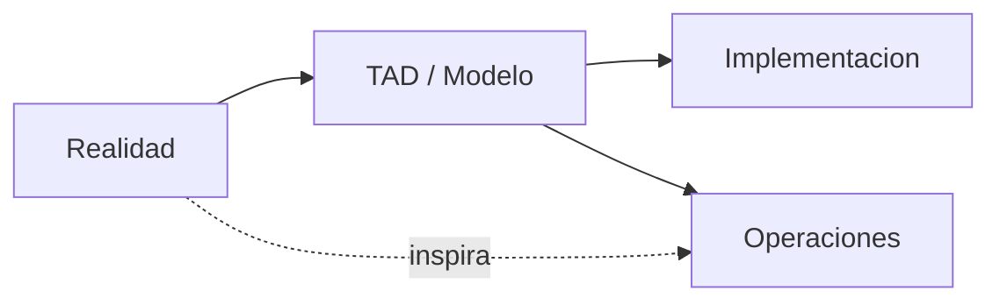
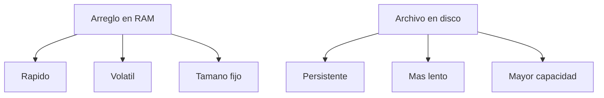
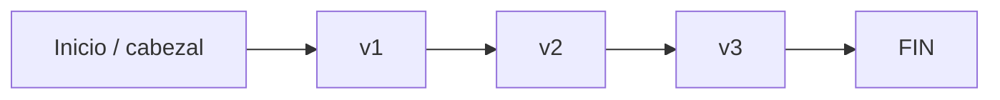

## Semana 01: TAD, arreglos estaticos, archivos y filas secuenciales
### Panorama rapido
- La semana mezcla teoria (TAD y modelado) con implementacion (arreglos y files).
- Idea central: modelar bien primero, programar despues.
- analogia: antes de construir una casa, primero haces plano, reglas y lista de materiales.

## Abstraccion y estructuras de datos
### Abstraccion
- Abstraer es quitar lo irrelevante y quedarse con lo esencial del problema.
- Tipos vistos: abstraccion de datos (TAD), funcional (subprogramas), iteradores.
- analogia: usar mapa del metro; no ves cada calle, solo lo necesario para llegar.

### Estructuras de datos
- Organizan informacion para usarla con eficiencia.
- Clasificacion general: lineales (arreglos, filas, listas, pilas, colas) y no lineales (arboles, grafos).
- analogia: ordenar libros en una fila de estantes (lineal) vs mapa de rutas entre ciudades (grafo).

## TAD (Tipo Abstracto de Datos)
### Definicion
- Un TAD define datos + operaciones permitidas, ocultando como se implementa.
- Programa orientado a modelado: `Programa = TAD + interfaz`.
- analogia: panel de ascensor; usas botones y comportamiento, no su circuito interno.

### Formato formal del TAD
- `TAD <nombre>`
- `<objeto abstracto>`
- `<invariante>`
- `<operaciones>`
- analogia: contrato de alquiler: identifica partes, reglas y acciones validas.

### Objeto abstracto
- Es la descripcion matematica/conceptual de los datos (sin lenguaje concreto).
- Ejemplos vistos: vector, conjunto, lista, matriz, diccionario.
- analogia: maqueta del edificio; representa distribucion sin decidir aun materiales exactos.

### Invariante
- Regla que siempre debe cumplirse antes y despues de cada operacion.
- Si se rompe, el TAD queda inconsistente.
- Ejemplo: en conjunto no hay repetidos y todos son del tipo correcto.
- analogia: DNI unico por persona; repetir DNI rompe la validez del padron.

### Operaciones: dominio y codominio
- Dominio: entradas de la operacion.
- Codominio: resultado esperado (TAD, booleano, entero, etc.).
- Clasificacion: constructoras, destructoras, modificadoras, analizadoras, persistencia.
- analogia: receta: ingredientes de entrada (dominio) y plato final (codominio).

### Pre y postcondicion
- Pre: condicion obligatoria antes de ejecutar.
- Post: estado garantizado luego de ejecutar (si la pre se cumplio).
- analogia: para rendir examen necesitas DNI (pre); al final obtienes nota registrada (post).

## Arreglos estaticos
### Definicion y propiedades
- Estructura estatica, contigua, homogenea, ordenada y finita.
- Acceso por indice con costo O(1).
- Ventaja: acceso rapido.
- Desventajas: volatilidad RAM, tamano fijo, insertar/eliminar cuesta por desplazamientos.
- analogia: casilleros numerados; ubicar uno es rapido, pero meter uno al medio obliga a mover varios.

### Tipos de arreglos
- Unidimensional (vector): `x[i]`.
- Bidimensional (matriz): `x[i][j]`.
- Multidimensional: `x[i][j][k]...`.
- analogia: cajonera de 1 nivel (vector), mueble de filas/columnas (matriz), deposito por pisos (3D).

### Representacion logica y fisica
- Logica: como se entiende en el modelo.
- Fisica: como queda en memoria RAM contigua.
- analogia: lista de asientos en papel (logica) vs personas sentadas realmente en el bus (fisica).

### Operaciones basicas en vector
- Crear, leer/cargar, mostrar, buscar, insertar, eliminar, editar.
- Busqueda vista: secuencial y binaria (segun orden).
- analogia: agenda telefonica; crear contactos, buscar por nombre, editar numero, borrar contacto.

### Ejemplo C++: vector estatico con operaciones basicas
```cpp
#include <iostream>
using namespace std;

const int MAX = 100;

struct VectorInt {
    int a[MAX];
    int n; // cantidad actual
};

void crear(VectorInt &v) { v.n = 0; }

bool adicionar(VectorInt &v, int dato) {
    if (v.n >= MAX) return false;
    v.a[v.n++] = dato;
    return true;
}

int buscarSec(const VectorInt &v, int dato) {
    for (int i = 0; i < v.n; i++) if (v.a[i] == dato) return i;
    return -1;
}
```

## Archivos (files) y almacenamiento secundario
### Idea principal
- RAM: volatil, rapida, limitada.
- Archivo en disco: persistente, mas lento, gran capacidad.
- analogia: mesa de trabajo (RAM) vs archivador de oficina (disco).

### Tipos y clasificaciones
- Por contenido: texto y binario.
- Por acceso: secuencial y directo.
- Por flujo: entrada, salida, entrada/salida.
- Por funcion: maestro, transaccion, reporte.
- analogia: biblioteca: catalogo publico (maestro), prestamos del dia (transaccion), reporte mensual (reporte).

### Acceso directo por registros
- Formula base: `dirFisica = dirLogica * tamRegistroBytes`.
- Ejemplo visto: registro alumno de 50 bytes.
- analogia: departamento en edificio: piso/logica -> direccion real exacta.

### Modos de apertura en C
- `r`: leer.
- `w`: escribir (crea o sobreescribe).
- `a`: agregar al final.
- analogia: abrir cuaderno solo lectura, empezar uno nuevo, o anotar al final.

## Fila secuencial (sobre archivos)
### Definicion y caracteristicas
- Estructura en almacenamiento secundario recorrida desde el inicio.
- Insercion normal al final.
- Para llegar al elemento `n`, se recorre lo anterior.
- analogia: cola en ventanilla; no saltas directo al quinto, avanzas uno por uno.

### Primitivas de acceso
- `ABRIR(f)`: posiciona cabezal al inicio.
- `PONER(f, v)`: escribe al final y avanza.
- `MARCAR(f, FIN)`: sella fin de fila.
- `TOMAR(f, v)`: lee siguiente valor.
- `ULTIMO(f)`: verifica marca de fin.
- analogia: cinta transportadora con marcador de fin de lote.

### Ejemplo C++ (simulacion de fila secuencial)
```cpp
#include <fstream>
using namespace std;

void crearFila(const char *nombre, int n) {
    ofstream f(nombre);
    for (int i = 0, v; i < n; i++) {
        cin >> v;
        f << v << " "; // PONER
    }
    f << "#"; // MARCAR fin
}
```

## Practica dirigida: TAD y conversiones
### TAD de practica
- Se trabajaron especificaciones de `Diccionario`, `Conjunto` y `Fila`.
- En diccionario: palabra con lista ordenada de significados.
- En conjunto: sin repetidos y con limites validos.
- analogia: diccionario real: cada palabra tiene varios sentidos ordenados.

### Ejercicios aplicados de archivos y estructuras estaticas
- Pasar vector -> fila secuencial.
- Pasar primos de vector -> fila.
- Pasar fila -> vector.
- Separar pares de fila en otra fila.
- Unir e intersectar dos filas ordenadas sin ordenar de nuevo.
- Separar notas aprobadas/desaprobadas de registros.
- analogia: clasificar boletas: primero juntas todo, luego separas por criterio sin reescribir toda la historia.

### Ejemplo C++: pasar vector a file secuencial
```cpp
#include <fstream>
using namespace std;

void pasarVectorAFila(const int x[], int n, const char *fileName) {
    ofstream f(fileName);
    if (!f) return;
    for (int i = 0; i < n; i++) f << x[i] << " ";
    f << "#";
}
```

## Mini resumen de examen
### Lo minimo que debes dominar
- Especificar un TAD: objeto abstracto, invariante, operaciones, pre/post.
- Diferenciar arreglo estatico vs archivo (velocidad, persistencia, capacidad).
- Implementar operaciones basicas en vector y fila secuencial.
- Aplicar primitivas de archivo: abrir, poner, tomar, marcar, ultimo.
- Resolver conversiones vector <-> fila y operaciones con filas ordenadas.
- analogia: toolkit basico de taller; si dominas estas llaves, puedes armar casi todo lo inicial del curso.

## Esquemas visuales utiles
### Relacion entre realidad, TAD e implementacion
- Sirve para entender por que primero se modela y luego se codifica.
- analogia: receta -> plato -> presentacion final.


### Arreglo vs archivo
- Sirve para justificar cuando usar RAM y cuando usar almacenamiento secundario.
- analogia: escritorio de trabajo vs archivador.


### Fila secuencial
- Sirve para visualizar por que se recorre desde el inicio y se agrega al final.
- analogia: cola en una ventanilla.

