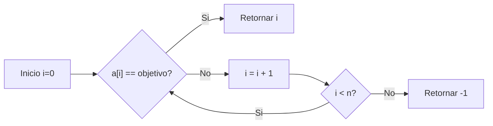
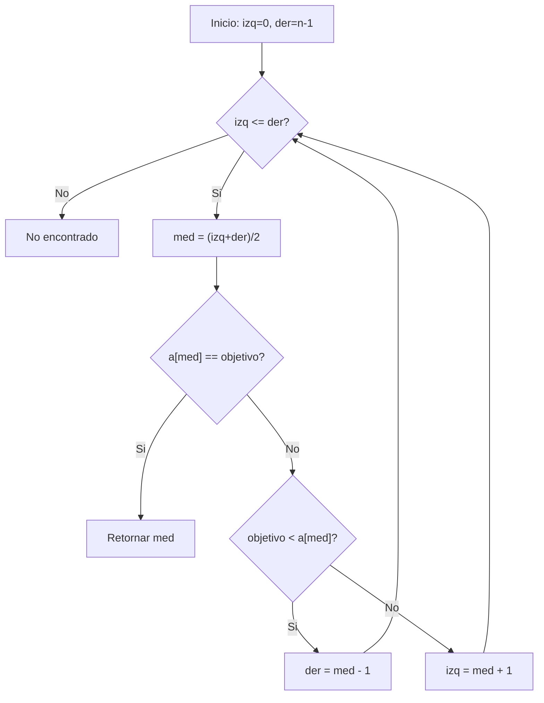
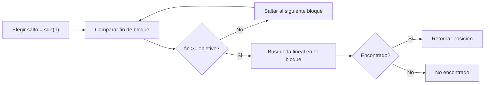
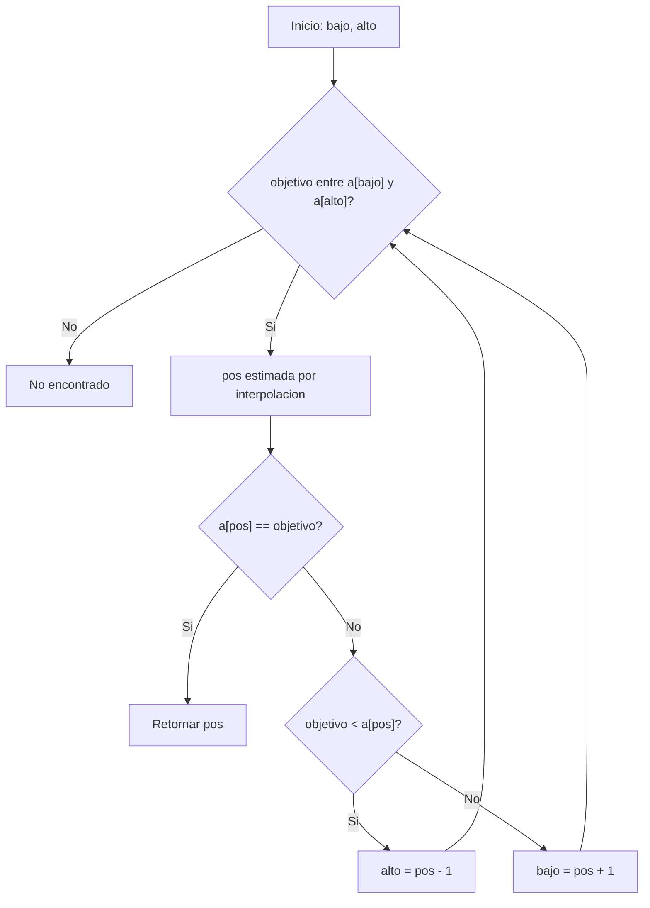
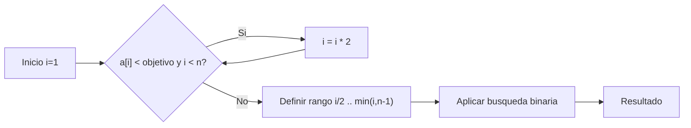
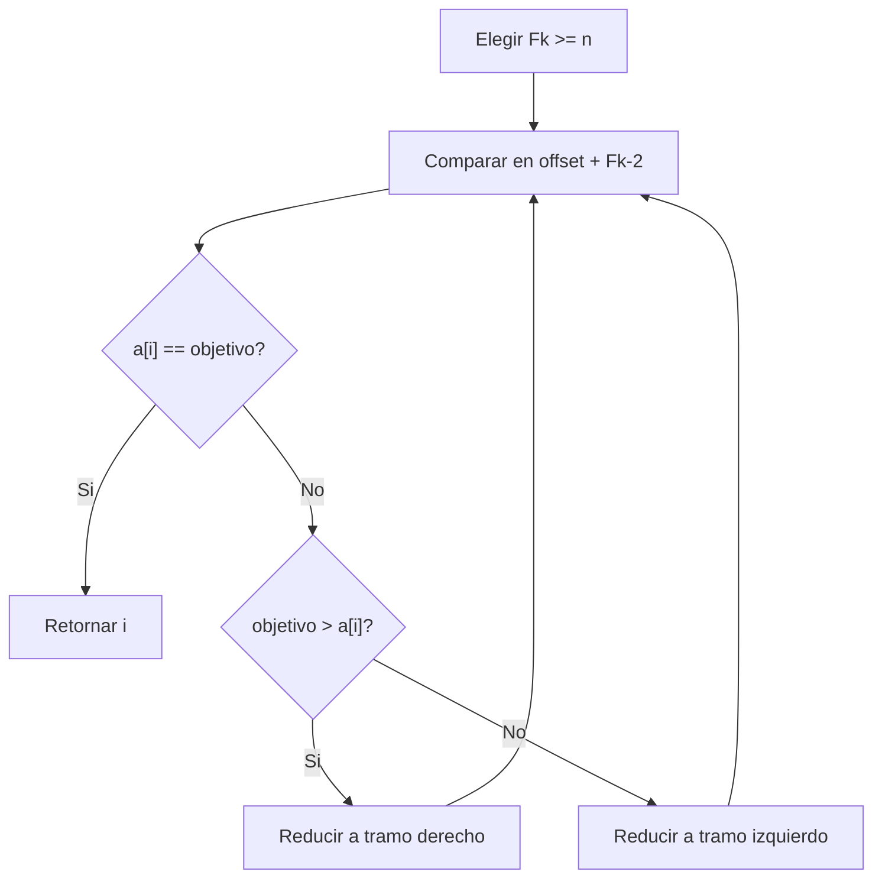
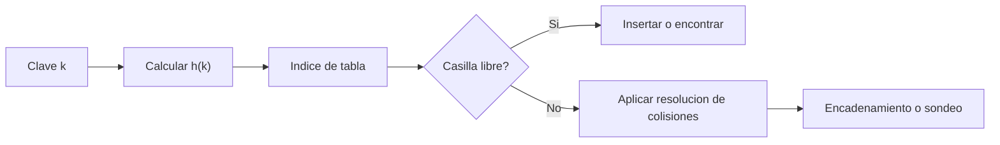

## Metodos de busqueda: idea general
### Definicion de busqueda
- Definicion breve: buscar es determinar si un dato existe en una coleccion y, si existe, en que posicion esta.
- Analogía: como buscar un nombre en una lista de asistencia para marcar presente.
- Ejemplo en codigo (C++):
```cpp
int buscar(const vector<int>& x, int dato) {
	for (int i = 0; i < (int)x.size(); i++) {
		if (x[i] == dato) return i;
	}
	return -1; // No encontrado
}
```

## Busqueda lineal (secuencial)
### Concepto
- Definicion breve: recorre los elementos uno por uno hasta encontrar el dato o terminar.
- Analogía: revisar cajon por cajon hasta encontrar una llave.
- Complejidad: mejor caso `O(1)`, peor caso `O(n)`.
- Cuando conviene: datos pequenos o no ordenados.
### Grafico

- Ejemplo en codigo (C++):
```cpp
int busquedaLineal(const vector<int>& a, int objetivo) {
	for (int i = 0; i < (int)a.size(); i++) {
		if (a[i] == objetivo) return i;
	}
	return -1;
}
```

## Busqueda binaria
### Concepto
- Definicion breve: en una lista ordenada, compara con el medio y descarta la mitad que no sirve.
- Analogía: adivinar un numero entre 1 y 100 preguntando "mayor o menor".
- Complejidad: mejor caso `O(1)`, peor caso `O(log n)`.
- Condicion clave: el arreglo debe estar ordenado.
### Grafico

- Ejemplo en codigo (C++):
```cpp
int busquedaBinaria(const vector<int>& a, int objetivo) {
	int izq = 0, der = (int)a.size() - 1;
	while (izq <= der) {
		int med = izq + (der - izq) / 2;
		if (a[med] == objetivo) return med;
		if (objetivo < a[med]) der = med - 1;
		else izq = med + 1;
	}
	return -1;
}
```

## Busqueda por salto (Jump Search)
### Concepto
- Definicion breve: avanza por bloques de tamano fijo y, al ubicar el bloque probable, aplica busqueda lineal dentro de ese bloque.
- Analogía: buscar una palabra en diccionario saltando pagina por pagina y luego leyendo una zona corta.
- Complejidad: aproximadamente `O(sqrt(n))`.
- Condicion clave: datos ordenados.
### Grafico


## Busqueda por interpolacion
### Concepto
- Definicion breve: mejora de binaria para datos uniformes; estima una posicion probable usando una formula.
- Analogía: abrir una guia telefonica cerca de la letra esperada en vez de ir justo al centro.
- Complejidad: puede acercarse a `O(log log n)` en distribucion uniforme, y degradar hasta `O(n)` en peor caso.
- Condicion clave: datos ordenados y con distribucion cercana a uniforme.
### Grafico


## Busqueda exponencial
### Concepto
- Definicion breve: primero encuentra un rango duplicando indices (`1, 2, 4, 8...`) y luego aplica binaria en ese rango.
- Analogía: buscar una direccion lejana avanzando en pasos cada vez mas grandes y luego afinando en la cuadra correcta.
- Complejidad: `O(log n)`.
- Condicion clave: datos ordenados.
### Grafico


## Busqueda Fibonacci
### Concepto
- Definicion breve: divide el arreglo usando tamanos basados en numeros Fibonacci para acotar la zona de busqueda.
- Analogía: cortar una fila en tramos con tamanos 8, 5, 3, 2... hasta hallar el asiento.
- Complejidad: `O(log n)`.
- Condicion clave: datos ordenados.
### Grafico


## Busqueda Hash
### Concepto
- Definicion breve: usa una funcion `h(clave)` para transformar la clave en una direccion de tabla y acceder rapido.
- Analogía: usar numero de casillero en vez de revisar todos los casilleros de un salon.
- Complejidad: promedio `O(1)` para buscar e insertar (depende de colisiones).
- Riesgo: si hay muchas colisiones, el rendimiento baja.
### Grafico


### Funcion hash y colisiones
- Definicion breve: una funcion hash mapea claves a indices `[0..M-1]`; dos claves pueden caer en el mismo indice (colision).
- Analogía: dos estudiantes con apellidos distintos asignados al mismo estante por una regla simple.
- Regla comun: `h(k) = k % M`.
- Recomendacion: mantener factor de carga bajo (aprox. menor a `0.75`).

### Hashing abierto (encadenamiento separado)
- Definicion breve: cada indice de la tabla guarda una lista de elementos que colisionaron en esa posicion.
- Analogía: si un casillero se llena, colocas una fila pequena de cajas etiquetadas con el mismo numero.
- Ejemplo en codigo (C++):
```cpp
class TablaHash {
private:
	vector<list<int>> tabla;
	int M;

	int h(int k) const { return k % M; }

public:
	explicit TablaHash(int tam) : tabla(tam), M(tam) {}

	void insertar(int k) {
		tabla[h(k)].push_back(k);
	}

	bool buscar(int k) const {
		int idx = h(k);
		for (int x : tabla[idx]) {
			if (x == k) return true;
		}
		return false;
	}
};
```

## Resumen rapido de uso
### Que metodo elegir
- Datos no ordenados y pocos: busqueda lineal.
- Datos ordenados y acceso por indice: busqueda binaria.
- Datos ordenados con distribucion uniforme: interpolacion puede mejorar.
- Busqueda por clave con muchas consultas: hash (si la funcion hash y colisiones estan bien controladas).